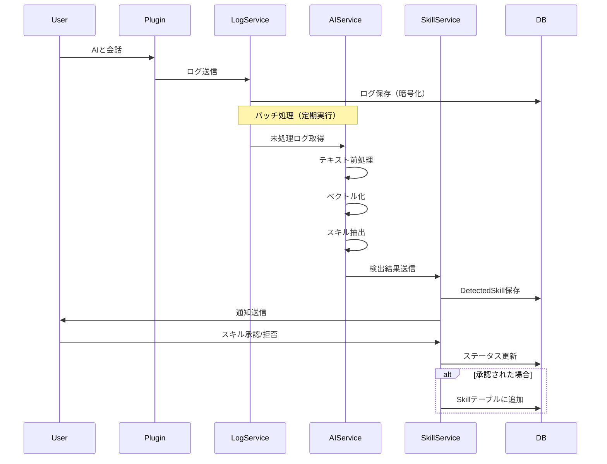
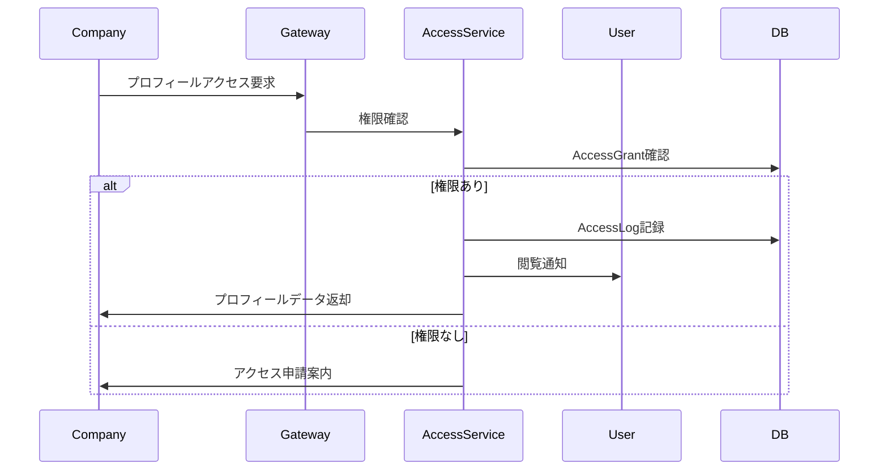
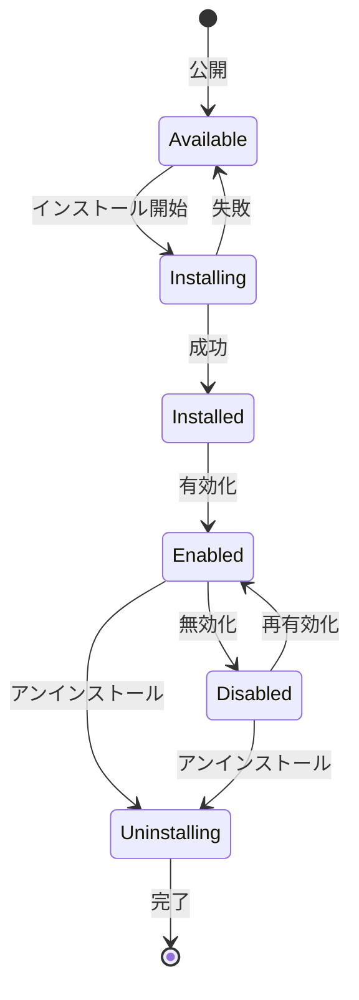
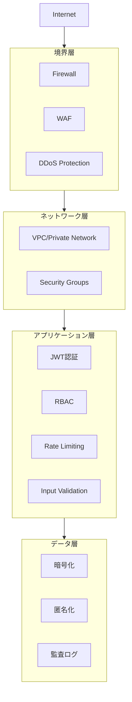

# システムアーキテクチャ

このドキュメントでは、Skill Profileシステムの全体的なアーキテクチャ、主要コンポーネント、設計判断について説明します。

## 目次

- [アーキテクチャ概要](#アーキテクチャ概要)
- [システム構成](#システム構成)
- [レイヤー構造](#レイヤー構造)
- [プラグインシステム](#プラグインシステム)
- [データフロー](#データフロー)
- [セキュリティアーキテクチャ](#セキュリティアーキテクチャ)
- [スケーラビリティ](#スケーラビリティ)
- [技術選定の理由](#技術選定の理由)

## アーキテクチャ概要

Skill Profileは、モジュラーで拡張可能なマイクロサービス指向のアーキテクチャを採用しています。

### 設計原則

1. **モジュラー設計**: 各機能は独立したモジュールとして実装
2. **プラグイン駆動**: コア機能を拡張可能なプラグインアーキテクチャ
3. **API ファースト**: 全機能はAPIを通じてアクセス可能
4. **プライバシー・バイ・デザイン**: データ保護を最優先
5. **スケーラビリティ**: 水平スケーリング可能な設計
6. **オープンソース**: コミュニティ駆動の開発

## システム構成

```mermaid
graph TB
    subgraph clients [クライアント層]
        WebApp[Web Application<br/>React/Vue.js]
        MobileApp[Mobile App<br/>React Native]
        PublicPage[Public Profile Page<br/>SSR]
        CLI[CLI Tool]
    end
    
    subgraph gateway [API Gateway Layer]
        APIGateway[API Gateway<br/>Kong/Nginx]
        LoadBalancer[Load Balancer]
        RateLimiter[Rate Limiter]
    end
    
    subgraph api [API Layer]
        RestAPI[REST API<br/>Express/FastAPI]
        GraphQL[GraphQL API<br/>Apollo Server]
        PluginAPI[Plugin API<br/>gRPC]
        WebSocket[WebSocket<br/>Real-time Updates]
    end
    
    subgraph plugins [Plugin Layer]
        ChatGPT[ChatGPT Plugin]
        Claude[Claude Plugin]
        GitHub[GitHub Plugin]
        Custom[Custom Plugins]
        PluginRegistry[Plugin Registry]
    end
    
    subgraph services [Service Layer]
        UserService[User Service]
        SkillService[Skill Service]
        LogService[Log Collection Service]
        AIService[AI Analysis Service]
        AccessService[Access Control Service]
        NotifyService[Notification Service]
    end
    
    subgraph data [Data Layer]
        PostgreSQL[(PostgreSQL<br/>Main DB)]
        LogDB[(MongoDB<br/>Log DB)]
        VectorDB[(ChromaDB<br/>Vector Store)]
        Redis[(Redis<br/>Cache)]
        S3[S3<br/>File Storage]
        Search[(Elasticsearch<br/>Search)]
    end
    
    subgraph queue [Message Queue]
        Kafka[Kafka/RabbitMQ<br/>Event Stream]
        Worker[Background Workers]
    end
    
    clients --> gateway
    gateway --> api
    api --> plugins
    api --> services
    plugins --> services
    services --> data
    services --> queue
    queue --> Worker
    Worker --> data
```



## レイヤー構造

### 1. クライアント層

複数のクライアントタイプをサポート：

#### Web Application
```typescript
// フロントエンドアーキテクチャ
src/
├── components/        # 再利用可能なUIコンポーネント
├── pages/            # ページコンポーネント
├── stores/           # 状態管理（Redux/Zustand）
├── services/         # APIクライアント
├── hooks/            # カスタムフック
├── utils/            # ユーティリティ関数
└── types/            # TypeScript型定義
```

**技術スタック:**
- React 18+ / Vue 3+
- TypeScript
- Tailwind CSS / Material-UI
- React Query / SWR（データフェッチング）
- Vite / Next.js（ビルド・SSR）

#### Mobile Application
- React Native
- 共通のビジネスロジックをWebと共有
- ネイティブ機能（通知、カメラ等）の統合

### 2. API Gateway Layer

すべてのクライアントリクエストの入口：

```yaml
# API Gateway設定例（Kong）
services:
  - name: skill-profile-api
    url: http://api-service:8080
    routes:
      - name: public-api
        paths: [/api/v1]
        strip_path: true
    plugins:
      - name: rate-limiting
        config:
          minute: 100
      - name: jwt
      - name: cors
```

**責務:**
- 認証・認可の一元管理
- レート制限
- リクエストルーティング
- ロードバランシング
- SSL/TLS終端
- API バージョニング

### 3. API Layer

#### REST API

```typescript
// REST APIエンドポイント構造
/api/v1/
├── /auth              # 認証・認可
│   ├── POST /register
│   ├── POST /login
│   └── POST /refresh
├── /users             # ユーザー管理
│   ├── GET /:id
│   ├── PUT /:id
│   └── DELETE /:id
├── /skills            # スキル管理
│   ├── GET /
│   ├── POST /
│   ├── PUT /:id
│   └── DELETE /:id
├── /projects          # プロジェクト管理
├── /logs              # 活動ログ
├── /plugins           # プラグイン管理
│   ├── GET /available
│   ├── POST /install
│   └── DELETE /uninstall
└── /ai                # AI分析
    ├── POST /analyze
    └── GET /suggestions
```

#### GraphQL API

```graphql
# スキーマ例
type User {
  id: ID!
  email: String!
  profile: Profile
  skills: [Skill!]!
  projects: [Project!]!
}

type Skill {
  id: ID!
  name: String!
  level: Int!
  category: SkillCategory!
  detectedFrom: [ActivityLog!]
  confidence: Float
}

type Query {
  me: User
  user(id: ID!): User
  skills(filter: SkillFilter): [Skill!]!
  searchUsers(query: String!): [User!]!
}

type Mutation {
  updateProfile(input: ProfileInput!): Profile!
  addSkill(input: SkillInput!): Skill!
  approveDetectedSkill(id: ID!): Skill!
}

type Subscription {
  skillDetected: Skill!
  profileViewed: AccessLog!
}
```

### 4. Plugin Layer

プラグインシステムはSkill Profileの核心機能です。

#### プラグインアーキテクチャ

```typescript
// プラグインインターフェース
interface Plugin {
  // メタデータ
  metadata: {
    name: string;
    version: string;
    author: string;
    description: string;
    permissions: Permission[];
  };
  
  // ライフサイクルフック
  onInstall(): Promise<void>;
  onEnable(): Promise<void>;
  onDisable(): Promise<void>;
  onUninstall(): Promise<void>;
  
  // コア機能
  collectLogs?(config: PluginConfig): Promise<ActivityLog[]>;
  extractSkills?(logs: ActivityLog[]): Promise<DetectedSkill[]>;
  
  // 設定
  validateConfig(config: PluginConfig): Promise<boolean>;
  getConfigSchema(): JSONSchema;
  
  // ヘルスチェック
  healthCheck(): Promise<PluginHealth>;
}

// プラグイン実装例
export class ChatGPTPlugin implements Plugin {
  metadata = {
    name: 'chatgpt-plugin',
    version: '1.0.0',
    author: 'Skill Profile Team',
    description: 'ChatGPT会話ログからスキルを抽出',
    permissions: ['read:logs', 'write:skills']
  };
  
  async collectLogs(config: PluginConfig): Promise<ActivityLog[]> {
    const openai = new OpenAI(config.apiKey);
    // 会話履歴を取得
    const conversations = await openai.listConversations();
    return conversations.map(conv => this.convertToLog(conv));
  }
  
  async extractSkills(logs: ActivityLog[]): Promise<DetectedSkill[]> {
    // AIで技術用語・スキルを抽出
    const skills = [];
    for (const log of logs) {
      const detected = await this.analyzeContent(log.content);
      skills.push(...detected);
    }
    return skills;
  }
  
  private async analyzeContent(content: string): Promise<DetectedSkill[]> {
    // 自然言語処理でスキル抽出
    // ...
  }
}
```

#### プラグイン登録・管理

```typescript
// プラグインレジストリ
class PluginRegistry {
  private plugins: Map<string, Plugin> = new Map();
  
  register(plugin: Plugin): void {
    // バリデーション
    this.validatePlugin(plugin);
    
    // サンドボックスで実行
    const sandboxed = this.createSandbox(plugin);
    this.plugins.set(plugin.metadata.name, sandboxed);
  }
  
  private createSandbox(plugin: Plugin): Plugin {
    // WebAssemblyまたはV8 Isolateでサンドボックス化
    // セキュリティ制約を適用
    return new Proxy(plugin, {
      get(target, prop) {
        // 権限チェック
        if (!hasPermission(target, prop)) {
          throw new Error('Permission denied');
        }
        return target[prop];
      }
    });
  }
}
```

### 5. Service Layer

各サービスは独立して動作し、疎結合を維持：

#### User Service

```typescript
class UserService {
  async createUser(data: CreateUserDTO): Promise<User> {
    // ユーザー作成ロジック
    const user = await this.userRepo.create(data);
    
    // イベント発行
    await this.eventBus.publish('user.created', user);
    
    return user;
  }
  
  async updateProfile(userId: string, data: ProfileDTO): Promise<Profile> {
    // プロフィール更新
  }
}
```

#### Skill Service

```typescript
class SkillService {
  async addSkill(userId: string, skill: SkillDTO): Promise<Skill> {
    // スキル追加
  }
  
  async detectSkillsFromLogs(logs: ActivityLog[]): Promise<DetectedSkill[]> {
    // AIServiceを呼び出してスキル検出
    const aiAnalysis = await this.aiService.analyzeForSkills(logs);
    
    // 信頼度スコアを計算
    const skills = aiAnalysis.map(s => ({
      ...s,
      confidence: this.calculateConfidence(s)
    }));
    
    return skills;
  }
}
```

#### AI Analysis Service

```typescript
class AIAnalysisService {
  async analyzeForSkills(logs: ActivityLog[]): Promise<SkillCandidate[]> {
    // ログを前処理
    const preprocessed = this.preprocessLogs(logs);
    
    // ベクトル化
    const embeddings = await this.vectorize(preprocessed);
    
    // ベクトルDBで類似スキルを検索
    const similar = await this.vectorDB.search(embeddings);
    
    // LLMで分析
    const analysis = await this.llm.analyze(logs);
    
    return this.combineResults(similar, analysis);
  }
  
  private async vectorize(text: string): Promise<number[]> {
    // テキストをベクトルに変換
    return await this.embeddingModel.encode(text);
  }
}
```

### 6. Data Layer

#### PostgreSQL（メインDB）

```sql
-- スキーマ例
CREATE TABLE users (
    id UUID PRIMARY KEY DEFAULT gen_random_uuid(),
    email VARCHAR(255) UNIQUE NOT NULL,
    password_hash VARCHAR(255) NOT NULL,
    created_at TIMESTAMP DEFAULT NOW(),
    updated_at TIMESTAMP DEFAULT NOW()
);

CREATE TABLE skills (
    id UUID PRIMARY KEY DEFAULT gen_random_uuid(),
    user_id UUID REFERENCES users(id) ON DELETE CASCADE,
    skill_name VARCHAR(255) NOT NULL,
    category VARCHAR(100),
    level INTEGER CHECK (level BETWEEN 1 AND 5),
    experience_years DECIMAL(4,2),
    is_public BOOLEAN DEFAULT true,
    created_at TIMESTAMP DEFAULT NOW(),
    updated_at TIMESTAMP DEFAULT NOW(),
    
    INDEX idx_user_skills (user_id),
    INDEX idx_skill_name (skill_name),
    FULLTEXT INDEX idx_skill_search (skill_name, category)
);

CREATE TABLE activity_logs (
    id UUID PRIMARY KEY DEFAULT gen_random_uuid(),
    user_id UUID REFERENCES users(id) ON DELETE CASCADE,
    plugin_id UUID REFERENCES plugins(id),
    source_type VARCHAR(50),
    content_encrypted BYTEA,
    metadata JSONB,
    created_at TIMESTAMP DEFAULT NOW(),
    processed_at TIMESTAMP,
    
    INDEX idx_user_logs (user_id, created_at DESC),
    INDEX idx_unprocessed (processed_at) WHERE processed_at IS NULL
);

CREATE TABLE detected_skills (
    id UUID PRIMARY KEY DEFAULT gen_random_uuid(),
    log_id UUID REFERENCES activity_logs(id) ON DELETE CASCADE,
    skill_name VARCHAR(255) NOT NULL,
    confidence_score DECIMAL(3,2) CHECK (confidence_score BETWEEN 0 AND 1),
    context TEXT,
    status VARCHAR(20) DEFAULT 'pending',
    user_approved_at TIMESTAMP,
    
    INDEX idx_pending_skills (status) WHERE status = 'pending'
);
```

#### MongoDB（ログDB）

```javascript
// ログドキュメントスキーマ
{
  _id: ObjectId,
  userId: UUID,
  pluginId: UUID,
  sourceType: 'ai_conversation' | 'code_edit' | 'github' | 'learning',
  timestamp: ISODate,
  content: {
    type: 'conversation' | 'commit' | 'document',
    data: {
      // プラグイン固有のデータ構造
      messages: [...],
      code: '...',
      // etc.
    }
  },
  metadata: {
    language: 'ja',
    detectedTopics: ['JavaScript', 'React'],
    sentiment: 0.8
  },
  processed: false,
  ttl: ISODate // 自動削除用
}

// TTLインデックス
db.activity_logs.createIndex(
  { "ttl": 1 },
  { expireAfterSeconds: 0 }
);
```

#### ChromaDB（ベクトルDB）

```python
# ベクトルストア設定
import chromadb

client = chromadb.Client()
collection = client.create_collection(
    name="skill_embeddings",
    metadata={"description": "Skill knowledge base"}
)

# スキル埋め込みの追加
collection.add(
    embeddings=[[0.1, 0.2, 0.3, ...]],
    documents=["React is a JavaScript library for building UIs"],
    metadatas=[{"skill": "React", "category": "Frontend"}],
    ids=["skill_react_001"]
)

# 類似スキル検索
results = collection.query(
    query_embeddings=[[0.15, 0.22, 0.28, ...]],
    n_results=10
)
```

#### Redis（キャッシュ）

```typescript
// キャッシュ戦略
class CacheService {
  async getUser(userId: string): Promise<User | null> {
    // キャッシュを確認
    const cached = await redis.get(`user:${userId}`);
    if (cached) return JSON.parse(cached);
    
    // DBから取得
    const user = await db.users.findById(userId);
    
    // キャッシュに保存（TTL: 1時間）
    await redis.setex(`user:${userId}`, 3600, JSON.stringify(user));
    
    return user;
  }
  
  async invalidateUser(userId: string): Promise<void> {
    await redis.del(`user:${userId}`);
  }
}
```

## データフロー

### スキル自動検出フロー



### アクセス制御フロー



## プラグインシステム

### プラグインライフサイクル



### プラグイン通信

```typescript
// gRPCプロトコル定義
syntax = "proto3";

service PluginService {
  rpc CollectLogs(LogRequest) returns (stream ActivityLog);
  rpc ExtractSkills(SkillRequest) returns (stream DetectedSkill);
  rpc HealthCheck(Empty) returns (HealthStatus);
}

message LogRequest {
  string user_id = 1;
  int64 since_timestamp = 2;
  PluginConfig config = 3;
}

message ActivityLog {
  string id = 1;
  string user_id = 2;
  string content = 3;
  map<string, string> metadata = 4;
  int64 timestamp = 5;
}
```

## セキュリティアーキテクチャ

### 多層防御



### データ暗号化

```typescript
// 暗号化サービス
class EncryptionService {
  private algorithm = 'aes-256-gcm';
  
  encrypt(data: string, key: Buffer): EncryptedData {
    const iv = crypto.randomBytes(16);
    const cipher = crypto.createCipheriv(this.algorithm, key, iv);
    
    let encrypted = cipher.update(data, 'utf8', 'hex');
    encrypted += cipher.final('hex');
    
    const authTag = cipher.getAuthTag();
    
    return {
      encrypted,
      iv: iv.toString('hex'),
      authTag: authTag.toString('hex')
    };
  }
  
  decrypt(data: EncryptedData, key: Buffer): string {
    const decipher = crypto.createDecipheriv(
      this.algorithm,
      key,
      Buffer.from(data.iv, 'hex')
    );
    
    decipher.setAuthTag(Buffer.from(data.authTag, 'hex'));
    
    let decrypted = decipher.update(data.encrypted, 'hex', 'utf8');
    decrypted += decipher.final('utf8');
    
    return decrypted;
  }
}
```

## スケーラビリティ

### 水平スケーリング

```yaml
# Kubernetes デプロイメント例
apiVersion: apps/v1
kind: Deployment
metadata:
  name: skill-profile-api
spec:
  replicas: 3
  selector:
    matchLabels:
      app: skill-profile-api
  template:
    metadata:
      labels:
        app: skill-profile-api
    spec:
      containers:
      - name: api
        image: skill-profile/api:latest
        resources:
          requests:
            memory: "512Mi"
            cpu: "500m"
          limits:
            memory: "1Gi"
            cpu: "1000m"
        env:
        - name: DATABASE_URL
          valueFrom:
            secretKeyRef:
              name: db-credentials
              key: url
---
apiVersion: autoscaling/v2
kind: HorizontalPodAutoscaler
metadata:
  name: skill-profile-api-hpa
spec:
  scaleTargetRef:
    apiVersion: apps/v1
    kind: Deployment
    name: skill-profile-api
  minReplicas: 3
  maxReplicas: 10
  metrics:
  - type: Resource
    resource:
      name: cpu
      target:
        type: Utilization
        averageUtilization: 70
```

### データベースシャーディング

```typescript
// ユーザーIDベースのシャーディング
class ShardedUserRepository {
  private shards: Database[];
  
  private getShardForUser(userId: string): Database {
    const hash = this.hashUserId(userId);
    const shardIndex = hash % this.shards.length;
    return this.shards[shardIndex];
  }
  
  async findUser(userId: string): Promise<User> {
    const shard = this.getShardForUser(userId);
    return await shard.users.findOne({ id: userId });
  }
}
```

## 技術選定の理由

### TypeScript
- 型安全性による開発効率向上
- 大規模プロジェクトの保守性
- 豊富なエコシステム

### PostgreSQL
- ACID準拠の信頼性
- JSONBによる柔軟なスキーマ
- 強力なインデックス機能

### Redis
- 高速なインメモリキャッシュ
- Pub/Subによるリアルタイム通信
- セッション管理

### Kafka/RabbitMQ
- 非同期処理の実現
- イベント駆動アーキテクチャ
- 高スループット

### ChromaDB
- ベクトル検索の効率性
- AIとの親和性
- オープンソース

## まとめ

このアーキテクチャは以下を実現します：

- **拡張性**: プラグインで機能追加が容易
- **スケーラビリティ**: 水平スケーリング可能
- **セキュリティ**: 多層防御とデータ暗号化
- **保守性**: モジュラー設計で変更が局所化
- **パフォーマンス**: キャッシュと非同期処理で最適化

詳細な実装ガイドは各サービスのREADMEを参照してください。
