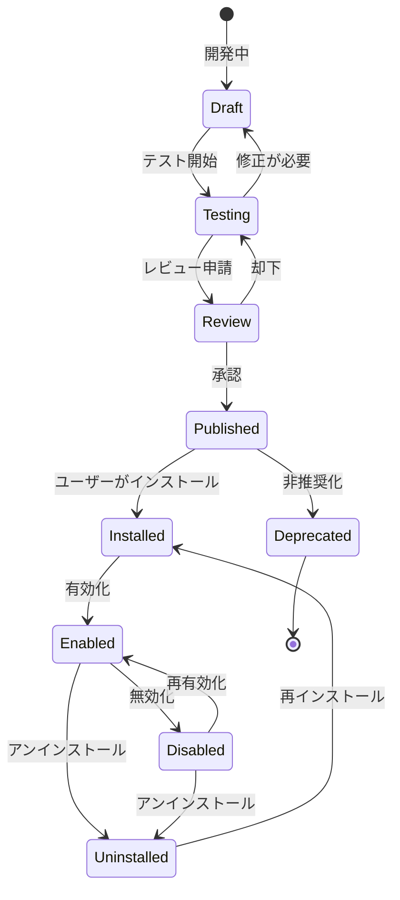

# プラグイン開発ガイド

このガイドでは、Skill Profile用のプラグインを開発する方法を説明します。

## 目次

- [概要](#概要)
- [プラグインシステムとは](#プラグインシステムとは)
- [開発環境のセットアップ](#開発環境のセットアップ)
- [プラグインの作成](#プラグインの作成)
- [プラグインAPI](#プラグインapi)
- [ベストプラクティス](#ベストプラクティス)
- [テストとデバッグ](#テストとデバッグ)
- [プラグインの公開](#プラグインの公開)
- [サンプルプラグイン](#サンプルプラグイン)

---

## 概要

Skill Profileのプラグインシステムは、外部サービスとの連携や独自の機能を追加するための拡張メカニズムです。プラグインを使用することで、以下が可能になります：

- **ログ収集**: AIチャット、コードエディタ、学習プラットフォーム等からの活動ログ収集
- **スキル抽出**: 収集したログからスキルキーワードの自動抽出
- **データ変換**: 外部データをSkill Profile形式に変換
- **カスタム分析**: 独自のスキル分析ロジックの実装

---

## プラグインシステムとは

### アーキテクチャ

```
┌─────────────────────────────────────────┐
│         Skill Profile Core              │
│                                         │
│  ┌──────────────────────────────────┐  │
│  │      Plugin Registry             │  │
│  │  - 登録                          │  │
│  │  - バージョン管理                │  │
│  │  - 権限管理                      │  │
│  └──────────────────────────────────┘  │
│                                         │
│  ┌──────────────────────────────────┐  │
│  │      Plugin Sandbox              │  │
│  │  - WebAssembly実行環境          │  │
│  │  - リソース制限                  │  │
│  │  - セキュリティ隔離              │  │
│  └──────────────────────────────────┘  │
└─────────────────────────────────────────┘
                    │
        ┌───────────┼───────────┐
        │           │           │
   ┌────▼────┐ ┌───▼────┐ ┌───▼────┐
   │ Plugin  │ │ Plugin │ │ Plugin │
   │    A    │ │    B   │ │    C   │
   └─────────┘ └────────┘ └────────┘
```

### プラグインのライフサイクル



---

## 開発環境のセットアップ

### 前提条件

- Node.js 18+ または Python 3.9+
- npm または yarn
- Git
- Skill Profile開発者アカウント

### Plugin SDK のインストール

#### TypeScript/JavaScript

```bash
# グローバルインストール
npm install -g @skill-profile/plugin-sdk

# またはプロジェクトにインストール
npm install --save-dev @skill-profile/plugin-sdk
```

#### Python

```bash
# pipでインストール
pip install skill-profile-plugin-sdk

# または仮想環境で
python -m venv venv
source venv/bin/activate  # Windowsの場合: venv\Scripts\activate
pip install skill-profile-plugin-sdk
```

### CLI ツールの確認

```bash
skill-profile-cli --version
# 出力: skill-profile-cli/1.0.0
```

---

## プラグインの作成

### 新しいプラグインの初期化

```bash
# インタラクティブモード
skill-profile-cli plugin create

# または直接指定
skill-profile-cli plugin create \
  --name my-awesome-plugin \
  --type ai-integration \
  --language typescript
```

対話形式で以下を入力：

```
? Plugin name: my-awesome-plugin
? Description: Awesome integration for Skill Profile
? Author: Your Name <your.email@example.com>
? License: Apache-2.0
? Language: TypeScript
? Plugin type: AI Integration
```

### 生成されるプロジェクト構造

```
my-awesome-plugin/
├── src/
│   ├── index.ts          # エントリーポイント
│   ├── plugin.ts         # プラグインメインクラス
│   ├── types.ts          # 型定義
│   └── utils/            # ユーティリティ
│       └── logger.ts
├── tests/
│   ├── plugin.test.ts    # テストファイル
│   └── fixtures/         # テストデータ
├── config/
│   └── schema.json       # 設定スキーマ
├── docs/
│   └── README.md         # プラグインドキュメント
├── package.json
├── tsconfig.json
├── .eslintrc.js
├── .gitignore
└── plugin.manifest.json  # プラグインメタデータ
```

---

## プラグインAPI

### プラグインインターフェース

#### TypeScript

```typescript
import {
  Plugin,
  PluginMetadata,
  PluginConfig,
  ActivityLog,
  DetectedSkill,
  PluginHealth
} from '@skill-profile/plugin-sdk';

export class MyAwesomePlugin implements Plugin {
  // メタデータ（必須）
  metadata: PluginMetadata = {
    name: 'my-awesome-plugin',
    version: '1.0.0',
    author: 'Your Name',
    description: 'Awesome integration for Skill Profile',
    homepage: 'https://github.com/your-name/my-awesome-plugin',
    repository: 'https://github.com/your-name/my-awesome-plugin',
    license: 'Apache-2.0',
    permissions: [
      'read:logs',
      'write:skills',
      'network:external'
    ],
    categories: ['ai-integration', 'automation'],
    icon: 'https://example.com/icon.png'
  };

  // ライフサイクルフック（オプション）
  async onInstall(): Promise<void> {
    console.log('プラグインがインストールされました');
    // 初期設定、データベーステーブルの作成等
  }

  async onEnable(): Promise<void> {
    console.log('プラグインが有効化されました');
    // 定期タスクの開始等
  }

  async onDisable(): Promise<void> {
    console.log('プラグインが無効化されました');
    // リソースのクリーンアップ等
  }

  async onUninstall(): Promise<void> {
    console.log('プラグインがアンインストールされました');
    // データの削除等
  }

  // コア機能（必須）
  
  /**
   * ログを収集する
   */
  async collectLogs(config: PluginConfig): Promise<ActivityLog[]> {
    const logs: ActivityLog[] = [];
    
    try {
      // 外部APIからデータを取得
      const data = await this.fetchExternalData(config);
      
      // ActivityLog形式に変換
      for (const item of data) {
        logs.push({
          id: item.id,
          userId: config.userId,
          pluginId: this.metadata.name,
          sourceType: 'ai_conversation',
          content: item.content,
          metadata: {
            timestamp: item.createdAt,
            language: item.language,
            tags: item.tags
          },
          createdAt: new Date(item.createdAt)
        });
      }
    } catch (error) {
      console.error('ログ収集エラー:', error);
    }
    
    return logs;
  }

  /**
   * ログからスキルを抽出する
   */
  async extractSkills(logs: ActivityLog[]): Promise<DetectedSkill[]> {
    const skills: DetectedSkill[] = [];
    
    for (const log of logs) {
      // 自然言語処理やパターンマッチングでスキルを検出
      const detected = await this.analyzeContent(log.content);
      
      for (const skill of detected) {
        skills.push({
          activityLogId: log.id,
          skillName: skill.name,
          skillCategory: skill.category,
          confidenceScore: skill.confidence,
          contextSnippet: this.extractContext(log.content, skill.name),
          detectionMethod: 'nlp',
          relatedSkills: skill.related || []
        });
      }
    }
    
    return skills;
  }

  /**
   * 設定を検証する
   */
  async validateConfig(config: PluginConfig): Promise<boolean> {
    // APIキーの検証
    if (!config.apiKey) {
      throw new Error('APIキーが設定されていません');
    }
    
    // 接続テスト
    try {
      await this.testConnection(config);
      return true;
    } catch (error) {
      throw new Error(`接続に失敗しました: ${error.message}`);
    }
  }

  /**
   * 設定スキーマを取得する
   */
  getConfigSchema(): JSONSchema {
    return {
      type: 'object',
      properties: {
        apiKey: {
          type: 'string',
          title: 'APIキー',
          description: 'サービスのAPIキーを入力してください',
          minLength: 32,
          secret: true  // マスク表示
        },
        syncInterval: {
          type: 'number',
          title: '同期間隔（分）',
          description: 'ログを同期する間隔',
          default: 60,
          minimum: 5,
          maximum: 1440
        },
        categories: {
          type: 'array',
          title: '収集カテゴリ',
          description: '収集するログのカテゴリ',
          items: {
            type: 'string',
            enum: ['all', 'technical', 'business', 'language']
          },
          default: ['all']
        }
      },
      required: ['apiKey']
    };
  }

  /**
   * ヘルスチェック
   */
  async healthCheck(): Promise<PluginHealth> {
    try {
      // プラグインの状態を確認
      const isHealthy = await this.checkServiceHealth();
      
      return {
        status: isHealthy ? 'healthy' : 'unhealthy',
        message: isHealthy ? 'All systems operational' : 'Service unavailable',
        lastChecked: new Date(),
        details: {
          apiStatus: 'ok',
          lastSync: await this.getLastSyncTime()
        }
      };
    } catch (error) {
      return {
        status: 'error',
        message: error.message,
        lastChecked: new Date()
      };
    }
  }

  // プライベートメソッド
  
  private async fetchExternalData(config: PluginConfig): Promise<any[]> {
    // 外部APIへのリクエスト実装
    const response = await fetch('https://api.example.com/data', {
      headers: {
        'Authorization': `Bearer ${config.apiKey}`
      }
    });
    return await response.json();
  }

  private async analyzeContent(content: string): Promise<any[]> {
    // コンテンツ分析ロジック
    // キーワード抽出、NLP等
    return [];
  }

  private extractContext(content: string, keyword: string, contextLength: number = 100): string {
    const index = content.toLowerCase().indexOf(keyword.toLowerCase());
    if (index === -1) return '';
    
    const start = Math.max(0, index - contextLength / 2);
    const end = Math.min(content.length, index + keyword.length + contextLength / 2);
    
    return '...' + content.substring(start, end) + '...';
  }

  private async testConnection(config: PluginConfig): Promise<void> {
    // 接続テストの実装
  }

  private async checkServiceHealth(): Promise<boolean> {
    // サービスの健全性チェック
    return true;
  }

  private async getLastSyncTime(): Promise<Date> {
    // 最終同期時刻の取得
    return new Date();
  }
}

// プラグインをエクスポート
export default MyAwesomePlugin;
```

#### Python

```python
from skill_profile_plugin_sdk import (
    Plugin,
    PluginMetadata,
    PluginConfig,
    ActivityLog,
    DetectedSkill,
    PluginHealth
)
from typing import List
from datetime import datetime

class MyAwesomePlugin(Plugin):
    def __init__(self):
        self.metadata = PluginMetadata(
            name='my-awesome-plugin',
            version='1.0.0',
            author='Your Name',
            description='Awesome integration for Skill Profile',
            homepage='https://github.com/your-name/my-awesome-plugin',
            repository='https://github.com/your-name/my-awesome-plugin',
            license='Apache-2.0',
            permissions=['read:logs', 'write:skills', 'network:external'],
            categories=['ai-integration', 'automation']
        )
    
    async def on_install(self) -> None:
        """インストール時の処理"""
        print('プラグインがインストールされました')
    
    async def on_enable(self) -> None:
        """有効化時の処理"""
        print('プラグインが有効化されました')
    
    async def on_disable(self) -> None:
        """無効化時の処理"""
        print('プラグインが無効化されました')
    
    async def on_uninstall(self) -> None:
        """アンインストール時の処理"""
        print('プラグインがアンインストールされました')
    
    async def collect_logs(self, config: PluginConfig) -> List[ActivityLog]:
        """ログを収集する"""
        logs = []
        
        try:
            # 外部APIからデータを取得
            data = await self._fetch_external_data(config)
            
            # ActivityLog形式に変換
            for item in data:
                logs.append(ActivityLog(
                    id=item['id'],
                    user_id=config.user_id,
                    plugin_id=self.metadata.name,
                    source_type='ai_conversation',
                    content=item['content'],
                    metadata={
                        'timestamp': item['created_at'],
                        'language': item['language'],
                        'tags': item['tags']
                    },
                    created_at=datetime.fromisoformat(item['created_at'])
                ))
        except Exception as e:
            print(f'ログ収集エラー: {e}')
        
        return logs
    
    async def extract_skills(self, logs: List[ActivityLog]) -> List[DetectedSkill]:
        """ログからスキルを抽出する"""
        skills = []
        
        for log in logs:
            # 自然言語処理やパターンマッチングでスキルを検出
            detected = await self._analyze_content(log.content)
            
            for skill in detected:
                skills.append(DetectedSkill(
                    activity_log_id=log.id,
                    skill_name=skill['name'],
                    skill_category=skill['category'],
                    confidence_score=skill['confidence'],
                    context_snippet=self._extract_context(log.content, skill['name']),
                    detection_method='nlp',
                    related_skills=skill.get('related', [])
                ))
        
        return skills
    
    async def validate_config(self, config: PluginConfig) -> bool:
        """設定を検証する"""
        if not config.api_key:
            raise ValueError('APIキーが設定されていません')
        
        try:
            await self._test_connection(config)
            return True
        except Exception as e:
            raise ValueError(f'接続に失敗しました: {e}')
    
    def get_config_schema(self) -> dict:
        """設定スキーマを取得する"""
        return {
            'type': 'object',
            'properties': {
                'api_key': {
                    'type': 'string',
                    'title': 'APIキー',
                    'description': 'サービスのAPIキーを入力してください',
                    'minLength': 32,
                    'secret': True
                },
                'sync_interval': {
                    'type': 'number',
                    'title': '同期間隔（分）',
                    'description': 'ログを同期する間隔',
                    'default': 60,
                    'minimum': 5,
                    'maximum': 1440
                },
                'categories': {
                    'type': 'array',
                    'title': '収集カテゴリ',
                    'description': '収集するログのカテゴリ',
                    'items': {
                        'type': 'string',
                        'enum': ['all', 'technical', 'business', 'language']
                    },
                    'default': ['all']
                }
            },
            'required': ['api_key']
        }
    
    async def health_check(self) -> PluginHealth:
        """ヘルスチェック"""
        try:
            is_healthy = await self._check_service_health()
            
            return PluginHealth(
                status='healthy' if is_healthy else 'unhealthy',
                message='All systems operational' if is_healthy else 'Service unavailable',
                last_checked=datetime.now(),
                details={
                    'api_status': 'ok',
                    'last_sync': await self._get_last_sync_time()
                }
            )
        except Exception as e:
            return PluginHealth(
                status='error',
                message=str(e),
                last_checked=datetime.now()
            )
    
    # プライベートメソッド
    
    async def _fetch_external_data(self, config: PluginConfig) -> List[dict]:
        """外部APIからデータを取得"""
        # 実装
        return []
    
    async def _analyze_content(self, content: str) -> List[dict]:
        """コンテンツを分析"""
        # 実装
        return []
    
    def _extract_context(self, content: str, keyword: str, context_length: int = 100) -> str:
        """キーワード周辺のコンテキストを抽出"""
        index = content.lower().find(keyword.lower())
        if index == -1:
            return ''
        
        start = max(0, index - context_length // 2)
        end = min(len(content), index + len(keyword) + context_length // 2)
        
        return '...' + content[start:end] + '...'
    
    async def _test_connection(self, config: PluginConfig) -> None:
        """接続テスト"""
        # 実装
        pass
    
    async def _check_service_health(self) -> bool:
        """サービスの健全性チェック"""
        return True
    
    async def _get_last_sync_time(self) -> datetime:
        """最終同期時刻を取得"""
        return datetime.now()
```

### 型定義

#### ActivityLog

```typescript
interface ActivityLog {
  id: string;
  userId: string;
  pluginId: string;
  sourceType: 'ai_conversation' | 'code_edit' | 'github_activity' | 'learning' | string;
  content: string;  // 暗号化前のコンテンツ
  metadata: {
    [key: string]: any;
  };
  createdAt: Date;
}
```

#### DetectedSkill

```typescript
interface DetectedSkill {
  activityLogId: string;
  skillName: string;
  skillCategory: string;
  confidenceScore: number;  // 0-1の範囲
  contextSnippet: string;
  detectionMethod: 'keyword' | 'nlp' | 'ml' | string;
  relatedSkills: string[];
}
```

#### PluginConfig

```typescript
interface PluginConfig {
  userId: string;
  pluginId: string;
  [key: string]: any;  // プラグイン固有の設定
}
```

---

## ベストプラクティス

### 1. エラーハンドリング

```typescript
async collectLogs(config: PluginConfig): Promise<ActivityLog[]> {
  try {
    const data = await this.fetchData(config);
    return this.transformData(data);
  } catch (error) {
    // エラーをログに記録
    console.error('Failed to collect logs:', error);
    
    // ユーザーフレンドリーなエラーメッセージ
    if (error.response?.status === 401) {
      throw new Error('APIキーが無効です。設定を確認してください。');
    }
    
    // 部分的な成功を許容
    return [];  // 空の配列を返す（全体のフローを停止しない）
  }
}
```

### 2. レート制限の遵守

```typescript
class RateLimiter {
  private lastRequest: Date;
  private minInterval: number;  // ミリ秒
  
  constructor(requestsPerMinute: number) {
    this.minInterval = 60000 / requestsPerMinute;
    this.lastRequest = new Date(0);
  }
  
  async throttle(): Promise<void> {
    const now = new Date();
    const elapsed = now.getTime() - this.lastRequest.getTime();
    
    if (elapsed < this.minInterval) {
      const waitTime = this.minInterval - elapsed;
      await new Promise(resolve => setTimeout(resolve, waitTime));
    }
    
    this.lastRequest = new Date();
  }
}

// 使用例
private rateLimiter = new RateLimiter(60);  // 60 req/min

async fetchData(url: string): Promise<any> {
  await this.rateLimiter.throttle();
  return await fetch(url);
}
```

### 3. データのプライバシー保護

```typescript
// センシティブ情報の除外
function sanitizeContent(content: string): string {
  // メールアドレスをマスク
  content = content.replace(
    /[\w.-]+@[\w.-]+\.\w+/g,
    '[EMAIL_REDACTED]'
  );
  
  // APIキーをマスク
  content = content.replace(
    /\b[A-Za-z0-9]{32,}\b/g,
    '[API_KEY_REDACTED]'
  );
  
  // クレジットカード番号をマスク
  content = content.replace(
    /\b\d{4}[\s-]?\d{4}[\s-]?\d{4}[\s-]?\d{4}\b/g,
    '[CARD_REDACTED]'
  );
  
  return content;
}

async collectLogs(config: PluginConfig): Promise<ActivityLog[]> {
  const logs = await this.fetchRawLogs(config);
  
  return logs.map(log => ({
    ...log,
    content: sanitizeContent(log.content)
  }));
}
```

### 4. 効率的なスキル検出

```typescript
// キャッシュを使用したスキル検出
class SkillDetector {
  private skillCache = new Map<string, DetectedSkill[]>();
  private vectorDB: VectorDatabase;
  
  async detectSkills(content: string): Promise<DetectedSkill[]> {
    // キャッシュをチェック
    const hash = this.hashContent(content);
    if (this.skillCache.has(hash)) {
      return this.skillCache.get(hash)!;
    }
    
    // ベクトル検索で類似スキルを取得
    const embedding = await this.embed(content);
    const similar = await this.vectorDB.search(embedding, 10);
    
    // NLPで追加のスキルを検出
    const nlpSkills = await this.nlpExtract(content);
    
    // 結合と重複排除
    const skills = this.mergeSkills(similar, nlpSkills);
    
    // キャッシュに保存
    this.skillCache.set(hash, skills);
    
    return skills;
  }
  
  private hashContent(content: string): string {
    // ハッシュ化の実装
    return crypto.createHash('sha256').update(content).digest('hex');
  }
}
```

### 5. 段階的なデータ収集

```typescript
async collectLogs(config: PluginConfig): Promise<ActivityLog[]> {
  const logs: ActivityLog[] = [];
  let page = 1;
  let hasMore = true;
  
  while (hasMore) {
    try {
      const batch = await this.fetchPage(config, page);
      logs.push(...batch);
      
      // 進捗を報告
      this.reportProgress({
        collected: logs.length,
        page: page
      });
      
      hasMore = batch.length > 0;
      page++;
      
      // 過度な負荷を避けるため、ページごとに待機
      await this.sleep(1000);
    } catch (error) {
      console.error(`Page ${page} failed:`, error);
      break;  // エラー時は既に収集したデータを返す
    }
  }
  
  return logs;
}
```

---

## テストとデバッグ

### ユニットテストの作成

```typescript
// tests/plugin.test.ts
import { MyAwesomePlugin } from '../src/plugin';
import { PluginConfig, ActivityLog } from '@skill-profile/plugin-sdk';

describe('MyAwesomePlugin', () => {
  let plugin: MyAwesomePlugin;
  let config: PluginConfig;
  
  beforeEach(() => {
    plugin = new MyAwesomePlugin();
    config = {
      userId: 'test-user',
      pluginId: 'my-awesome-plugin',
      apiKey: 'test-api-key'
    };
  });
  
  describe('collectLogs', () => {
    it('should collect logs successfully', async () => {
      const logs = await plugin.collectLogs(config);
      
      expect(logs).toBeInstanceOf(Array);
      expect(logs.length).toBeGreaterThan(0);
      expect(logs[0]).toHaveProperty('id');
      expect(logs[0]).toHaveProperty('content');
    });
    
    it('should handle API errors gracefully', async () => {
      const invalidConfig = { ...config, apiKey: 'invalid' };
      
      await expect(plugin.collectLogs(invalidConfig)).resolves.toEqual([]);
    });
  });
  
  describe('extractSkills', () => {
    it('should extract skills from logs', async () => {
      const logs: ActivityLog[] = [{
        id: '1',
        userId: 'test-user',
        pluginId: 'my-awesome-plugin',
        sourceType: 'ai_conversation',
        content: 'I am learning React and TypeScript for web development',
        metadata: {},
        createdAt: new Date()
      }];
      
      const skills = await plugin.extractSkills(logs);
      
      expect(skills).toBeInstanceOf(Array);
      expect(skills.length).toBeGreaterThan(0);
      
      const reactSkill = skills.find(s => s.skillName === 'React');
      expect(reactSkill).toBeDefined();
      expect(reactSkill.confidenceScore).toBeGreaterThan(0);
      expect(reactSkill.confidenceScore).toBeLessThanOrEqual(1);
    });
  });
  
  describe('validateConfig', () => {
    it('should validate correct config', async () => {
      await expect(plugin.validateConfig(config)).resolves.toBe(true);
    });
    
    it('should reject invalid config', async () => {
      const invalidConfig = { ...config, apiKey: undefined };
      
      await expect(plugin.validateConfig(invalidConfig))
        .rejects
        .toThrow('APIキーが設定されていません');
    });
  });
});
```

### ローカルでのテスト

```bash
# プラグインのビルド
npm run build

# テストの実行
npm test

# カバレッジレポート
npm run test:coverage

# ローカルでプラグインを実行
skill-profile-cli plugin run ./dist
```

### デバッグモード

```bash
# デバッグログを有効にして実行
DEBUG=skill-profile:* skill-profile-cli plugin run ./dist

# 特定のプラグインのみデバッグ
DEBUG=skill-profile:plugin:my-awesome-plugin npm run dev
```

---

## プラグインの公開

### 1. プラグインのビルド

```bash
# 本番ビルド
npm run build

# 最適化
npm run optimize
```

### 2. マニフェストの更新

`plugin.manifest.json`:

```json
{
  "name": "my-awesome-plugin",
  "version": "1.0.0",
  "description": "Awesome integration for Skill Profile",
  "author": "Your Name <your.email@example.com>",
  "license": "Apache-2.0",
  "homepage": "https://github.com/your-name/my-awesome-plugin",
  "repository": {
    "type": "git",
    "url": "https://github.com/your-name/my-awesome-plugin.git"
  },
  "keywords": ["skill-profile", "plugin", "ai", "integration"],
  "categories": ["ai-integration", "automation"],
  "permissions": [
    "read:logs",
    "write:skills",
    "network:external"
  ],
  "dependencies": {
    "@skill-profile/plugin-sdk": "^1.0.0"
  },
  "engines": {
    "node": ">=18.0.0"
  },
  "icon": "https://example.com/icon.png",
  "screenshots": [
    "https://example.com/screenshot1.png",
    "https://example.com/screenshot2.png"
  ]
}
```

### 3. ドキュメントの作成

`docs/README.md`:

```markdown
# My Awesome Plugin

## 概要

このプラグインは...

## 機能

- ログ収集
- スキル自動検出
- ...

## セットアップ

1. プラグインをインストール
2. APIキーを取得
3. 設定を入力

## 使い方

...

## トラブルシューティング

...
```

### 4. プラグインの公開申請

```bash
# プラグインをパッケージ化
skill-profile-cli plugin package

# プラグインマーケットに公開申請
skill-profile-cli plugin publish \
  --package ./dist/my-awesome-plugin-1.0.0.tgz \
  --message "初回リリース"
```

### 5. レビュープロセス

公開申請後、以下のレビューが行われます：

1. **自動チェック**
   - マニフェストの妥当性
   - セキュリティスキャン
   - 依存関係の確認

2. **手動レビュー**
   - コード品質
   - セキュリティベストプラクティス
   - ドキュメントの完全性

3. **テスト**
   - サンプルデータでの動作確認
   - パフォーマンステスト

### 6. 公開後のメンテナンス

```bash
# バージョンのアップデート
npm version patch  # 1.0.0 -> 1.0.1
npm version minor  # 1.0.0 -> 1.1.0
npm version major  # 1.0.0 -> 2.0.0

# 更新版の公開
skill-profile-cli plugin publish \
  --package ./dist/my-awesome-plugin-1.1.0.tgz \
  --changelog "バグ修正とパフォーマンス改善"
```

---

## サンプルプラグイン

### ChatGPTプラグイン（簡略版）

```typescript
import { Plugin, ActivityLog, DetectedSkill } from '@skill-profile/plugin-sdk';
import { OpenAI } from 'openai';

export class ChatGPTPlugin implements Plugin {
  metadata = {
    name: 'chatgpt-plugin',
    version: '1.0.0',
    description: 'ChatGPT会話からスキルを抽出',
    permissions: ['read:logs', 'write:skills', 'network:external']
  };

  async collectLogs(config: PluginConfig): Promise<ActivityLog[]> {
    const openai = new OpenAI({ apiKey: config.apiKey });
    const conversations = await openai.conversations.list({
      limit: 100
    });

    return conversations.data.map(conv => ({
      id: conv.id,
      userId: config.userId,
      pluginId: 'chatgpt-plugin',
      sourceType: 'ai_conversation',
      content: conv.messages.map(m => m.content).join('\n\n'),
      metadata: {
        model: conv.model,
        timestamp: conv.created_at
      },
      createdAt: new Date(conv.created_at * 1000)
    }));
  }

  async extractSkills(logs: ActivityLog[]): Promise<DetectedSkill[]> {
    const skills: DetectedSkill[] = [];
    
    // 技術用語のパターン
    const techPatterns = [
      /\b(React|Vue|Angular|TypeScript|JavaScript|Python|Java|Go)\b/gi,
      /\b(Docker|Kubernetes|AWS|GCP|Azure)\b/gi,
      /\b(PostgreSQL|MongoDB|Redis|MySQL)\b/gi
    ];

    for (const log of logs) {
      for (const pattern of techPatterns) {
        const matches = log.content.match(pattern);
        if (matches) {
          for (const match of new Set(matches)) {
            skills.push({
              activityLogId: log.id,
              skillName: match,
              skillCategory: 'Technical',
              confidenceScore: 0.8,
              contextSnippet: this.extractContext(log.content, match),
              detectionMethod: 'keyword',
              relatedSkills: []
            });
          }
        }
      }
    }

    return skills;
  }

  // ... その他のメソッド
}
```

### GitHubプラグイン（簡略版）

```typescript
import { Plugin, ActivityLog, DetectedSkill } from '@skill-profile/plugin-sdk';
import { Octokit } from '@octokit/rest';

export class GitHubPlugin implements Plugin {
  metadata = {
    name: 'github-plugin',
    version: '1.0.0',
    description: 'GitHub活動からスキルを抽出',
    permissions: ['read:logs', 'write:skills', 'network:external']
  };

  async collectLogs(config: PluginConfig): Promise<ActivityLog[]> {
    const octokit = new Octokit({ auth: config.accessToken });
    
    // ユーザーのリポジトリを取得
    const { data: repos } = await octokit.repos.listForAuthenticatedUser({
      sort: 'updated',
      per_page: 100
    });

    const logs: ActivityLog[] = [];

    for (const repo of repos) {
      // コミット履歴
      const { data: commits } = await octokit.repos.listCommits({
        owner: repo.owner.login,
        repo: repo.name,
        author: config.username,
        per_page: 100
      });

      for (const commit of commits) {
        logs.push({
          id: commit.sha,
          userId: config.userId,
          pluginId: 'github-plugin',
          sourceType: 'github_activity',
          content: commit.commit.message,
          metadata: {
            repo: repo.full_name,
            language: repo.language,
            timestamp: commit.commit.author.date
          },
          createdAt: new Date(commit.commit.author.date)
        });
      }
    }

    return logs;
  }

  async extractSkills(logs: ActivityLog[]): Promise<DetectedSkill[]> {
    const languageCount = new Map<string, number>();
    
    // 使用言語を集計
    for (const log of logs) {
      const lang = log.metadata.language;
      if (lang) {
        languageCount.set(lang, (languageCount.get(lang) || 0) + 1);
      }
    }

    // スキルとして変換
    return Array.from(languageCount.entries()).map(([lang, count]) => ({
      activityLogId: logs[0].id,
      skillName: lang,
      skillCategory: 'Programming Language',
      confidenceScore: Math.min(count / 100, 1.0),
      contextSnippet: `${count}個のコミットで使用`,
      detectionMethod: 'github_analysis',
      relatedSkills: []
    }));
  }

  // ... その他のメソッド
}
```

---

## サポートとリソース

### ドキュメント

- [Plugin API Reference](https://docs.skillprofile.example.com/plugin-api)
- [SDK Documentation](https://docs.skillprofile.example.com/sdk)
- [Example Plugins](https://github.com/skill-profile/example-plugins)

### コミュニティ

- [GitHub Discussions](https://github.com/skill-profile/skill-profile/discussions)
- [Discord Server](https://discord.gg/skill-profile)
- [Stack Overflow](https://stackoverflow.com/questions/tagged/skill-profile)

### サポート

- バグ報告: [GitHub Issues](https://github.com/skill-profile/skill-profile/issues)
- 機能リクエスト: [GitHub Discussions](https://github.com/skill-profile/skill-profile/discussions/categories/ideas)
- メール: plugin-support@skillprofile.example.com

---

## 次のステップ

1. [サンプルプラグイン](https://github.com/skill-profile/example-plugins)を試す
2. 独自のプラグインを開発する
3. コミュニティに共有する
4. フィードバックを受け取り改善する

Happy Plugin Development! 🚀
