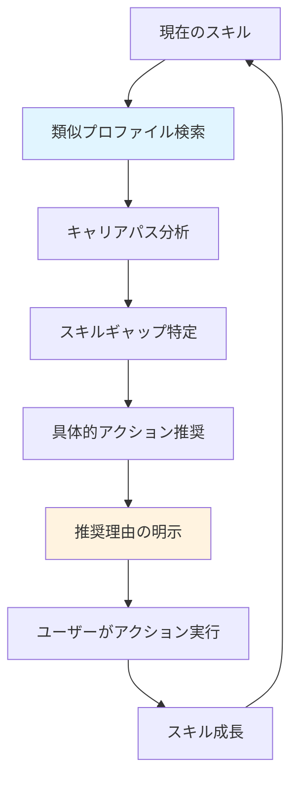
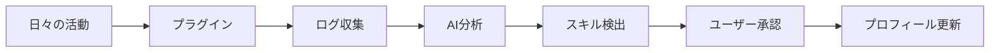

# Skill Profile

<div align="center">

**AI駆動のオープンソース スキルプロファイル管理システム**

[](LICENSE)
[](CONTRIBUTING.md)
[](CODE_OF_CONDUCT.md)

[English](README.md) | [日本語](README.ja.md)

</div>

---

## 🌟 特徴

Skill Profileは、**全職種の個人がスキルとキャリアを自分でコントロール**できる、透明性のあるオープンソースキャリアプラットフォームです。

### 🎯 全職種対応のスキル可視化

エンジニアだけでなく、**営業、マーケティング、人事、経営層など、あらゆる職種のスキルを評価**：

- **ソフトスキル**: コミュニケーション、時間管理、問題解決、リーダーシップ
- **ビジネススキル**: 戦略思考、顧客志向、財務理解、経営センス
- **アントレプレナーシップ**: 構想力、実行力、リスクテイク、事業開発
- **ハードスキル**: 職種別の専門スキル（技術、デザイン、営業、財務等）

### 🤖 AI自動スキル検出（全職種対応）

日々の活動ログから**AIが自動的にスキルを抽出**。手動入力の手間を大幅に削減：

- **コミュニケーション分析**: Slack、メール、会議からコミュニケーション能力を評価
- **時間管理分析**: カレンダー、タスク管理ツールから締切意識を評価
- **問題解決分析**: 課題トラッキング、提案書から分析力・実行力を評価
- **AIペット連携**: ChatGPT、Claudeとの会話から学習・思考スキルを検出
- **技術活動分析**: GitHub、VSCodeの活動から技術スキルを判定
- **プライバシー重視**: ローカル処理オプションで機密情報も安心

### 🔍 透明性のあるキャリアパス推奨

**すべてのアルゴリズムを公開**。なぜその推奨なのかを明確に説明：

- **類似プロファイル発見**: あなたと似た経歴の人がどのようなキャリアを辿ったか
- **スキルギャップ分析**: 目標達成に必要なスキルと現状のギャップを可視化
- **具体的アクション推奨**: 習得すべきスキル、学習リソース、実践機会を提示
- **推奨理由の明示**: なぜその推奨なのか、データとロジックを完全公開
- **バイアス検出・補正**: 性別、年齢等のバイアスを検出し、公平性を保証

### 🔓 オープンアルゴリズム - 他サービスとの最大の差別化

**ブラックボックスなレコメンデーションを排除**。すべてのアルゴリズムをGitHubで公開：

- レコメンデーションのコードが誰でも確認可能
- 推奨の計算プロセスをステップバイステップで説明
- バイアス分析結果を定期的に公開
- コミュニティがアルゴリズムを監査・改善可能
- 説明可能AI（SHAP、LIME）で各要素の寄与度を可視化

### 🔌 プラグインエコシステム（全職種対応）

誰でもプラグインを開発・共有できるオープンなエコシステム：

- **標準化されたAPI**: 簡単にプラグインを開発できるSDK
- **多様な連携**: 
  - **コミュニケーション**: Slack、Teams、Gmail、Zoom
  - **タスク管理**: Asana、Trello、Jira、Notion
  - **営業・CRM**: Salesforce、HubSpot
  - **AI対話**: ChatGPT、Claude、Gemini
  - **技術**: GitHub、VSCode、Cursor
  - **学習**: Udemy、Coursera
- **コミュニティマーケット**: プラグインを公開・共有
- **セキュア実行**: サンドボックスで安全に実行

### 🔐 個人データのOwnership

あなたのデータは、あなたのもの：

- **完全なコントロール**: いつでもデータをエクスポート・削除可能
- **柔軟なアクセス制御**: 項目別・期限付きで企業にデータ開示
- **暗号化**: エンドツーエンドの暗号化でプライバシー保護
- **GDPR準拠**: 個人情報保護法に完全対応

### 📊 客観的な証跡ベース

主観ではなく、客観的なデータに基づくスキル評価：

- **資格・証明書**: 公式認定の管理と証明
- **活動ログ**: GitHubコミット、プロジェクト経験
- **AI分析**: 使用頻度・複雑度からの習熟度推定
- **第三者評価**: 上司・同僚からのフィードバック

---

## 🎨 プロトタイプを試す

プロジェクトのUIプロトタイプをすぐに確認できます：

### ダッシュボードプロトタイプ（推奨）

📂 **場所**: [`prototype/dashboard/`](./prototype/dashboard/)

**実装済みページ:**
- 🏠 **ダッシュボード** - ホーム画面、統計表示
- 👤 **プロフィール** - ユーザー情報表示・編集
- ⭐ **スキル一覧** - スキル管理、フィルター機能
- ⚙️ **設定** - アカウント設定、プライバシー設定

**開き方:**
```bash
# プロトタイプをブラウザで開く
open prototype/dashboard/index.html

# または、ローカルサーバーで実行
python -m http.server 8000
# ブラウザで http://localhost:8000/prototype/dashboard/ を開く
```

詳細は [prototype/dashboard/README.md](./prototype/dashboard/README.md) を参照してください。

---

## 🚀 クイックスタート

### Docker を使った最速セットアップ

```bash
# リポジトリのクローン
git clone https://github.com/chibahiro24/skill-profile.git
cd skill-profile

# Docker Composeで起動
docker-compose up -d

# ブラウザでアクセス
open http://localhost:3000
```

### ローカル開発環境

```bash
# 依存関係のインストール
npm install  # またはyarn/pnpm

# 環境変数の設定
cp .env.example .env
# .envファイルを編集してAPIキー等を設定

# データベースのセットアップ
npm run db:setup

# 開発サーバーの起動
npm run dev
```

詳細は [DEPLOYMENT.md](DEPLOYMENT.md) を参照してください。

---

## 📖 ドキュメント

### ユーザー向け

- **[ユーザーガイド](./docs/USER_GUIDE.md)** - 基本的な使い方
- **[キャリアパス機能ガイド](./docs/CAREER_PATH_GUIDE.md)** - キャリアパス推奨機能の詳細
- **[プライバシーポリシー](./docs/PRIVACY_POLICY.md)** - データの取り扱い
- **[FAQ](./docs/FAQ.md)** - よくある質問

### 透明性・フェアネス

- **[アルゴリズム透明性ドキュメント](./docs/ALGORITHM_TRANSPARENCY.md)** - すべてのアルゴリズムの詳細説明
- **[フェアネス監査レポート](./docs/FAIRNESS_REPORT.md)** - 定期的なバイアス分析結果
- **[コミュニティ監査ガイド](./docs/COMMUNITY_AUDIT.md)** - コミュニティ監査への参加方法

### 開発者向け

- **[ARCHITECTURE.md](ARCHITECTURE.md)** - システムアーキテクチャの詳細
- **[REQUIREMENTS.md](REQUIREMENTS.md)** - 機能要件・非機能要件
- **[CONTRIBUTING.md](CONTRIBUTING.md)** - コントリビューション方法
- **[DEPLOYMENT.md](DEPLOYMENT.md)** - デプロイ手順

### プラグイン開発者向け

- **[PLUGIN_DEVELOPMENT.md](PLUGIN_DEVELOPMENT.md)** - プラグイン開発ガイド
- **[Plugin API Reference](./docs/api/plugin-api.md)** - APIリファレンス
- **[プラグインサンプル](./plugins/examples/)** - サンプルコード

---

## 🎯 主要機能

### 1. 透明性のあるキャリアパス推奨



**透明性の特徴:**
- すべてのアルゴリズムをGitHubで公開
- 推奨の計算プロセスを完全説明
- バイアス検出・補正結果を公開
- コミュニティによる監査可能

### 2. AI自動スキル判定（全職種対応）



**対応プラットフォーム（全職種）:**
- **コミュニケーション**: Slack / Teams / Gmail / Zoom
- **タスク管理**: Asana / Trello / Jira / Notion
- **営業・CRM**: Salesforce / HubSpot
- **AI対話**: ChatGPT / Claude / Gemini
- **技術**: GitHub / GitLab / VSCode / Cursor
- **学習**: Udemy / Coursera / Kindle

### 3. スキルプロファイル管理（全職種対応）

- **包括的スキル体系**: 
  - ソフトスキル（コミュニケーション、時間管理、問題解決等）
  - リーダーシップ・マネジメント
  - ビジネス・戦略スキル
  - アントレプレナーシップ
  - 経営スキル
  - ハードスキル（職種別専門スキル）
- **100点満点評価**: より細かいレベル管理
- **証跡管理**: 資格証明書、修了証、活動ログのアップロード
- **公開制御**: 項目別の詳細な公開設定

### 4. 透明性のあるキャリア支援

- **類似プロファイル発見**: あなたと似た人がどのようなキャリアを歩んだか
- **キャリアパス分析**: 複数の選択肢と実現可能性を提示
- **スキルギャップ分析**: 目標とのギャップを定量的に可視化
- **具体的アクション推奨**: 学習リソース、プロジェクト、コミュニティを推奨
- **推奨理由の完全説明**: なぜその推奨なのかをデータで説明
- **成長トラッキング**: スキルの時系列変化を追跡

### 4. データ可視化

- **レーダーチャート**: スキル分野別の可視化
- **スキルツリー**: 階層的なスキル表示
- **成長グラフ**: 時系列でのスキル推移
- **市場価値分析**: 類似プロファイルとの比較

### 5. アクセス制御

- **柔軟な権限管理**: 項目別・期限付きのアクセス許可
- **アクセスログ**: 誰がいつ閲覧したかを記録
- **即時取り消し**: ワンクリックで権限を取り消し
- **データエクスポート**: PDF、JSON、CSV形式で出力

### 6. 企業向け機能

- **候補者検索**: スキルフィルタリング検索
- **社内スキルマップ**: 組織全体のスキル可視化
- **チーム編成支援**: 最適なチーム構成の提案
- **研修計画**: スキルギャップに基づく計画立案

---

## 🔌 プラグイン開発

Skill Profileは、誰でもプラグインを開発・共有できるオープンなエコシステムです。

### プラグインの作成

```bash
# Plugin Development SDKのインストール
npm install -g @skill-profile/plugin-sdk

# 新しいプラグインの作成
skill-profile-cli plugin create my-awesome-plugin

# プラグインのテスト
cd my-awesome-plugin
npm test

# プラグインのビルド
npm run build
```

### プラグインの基本構造

```typescript
import { Plugin, PluginConfig, ActivityLog, DetectedSkill } from '@skill-profile/plugin-sdk';

export class MyAwesomePlugin implements Plugin {
  metadata = {
    name: 'my-awesome-plugin',
    version: '1.0.0',
    description: '素晴らしいプラグイン',
    permissions: ['read:logs', 'write:skills']
  };

  async collectLogs(config: PluginConfig): Promise<ActivityLog[]> {
    // ログ収集ロジック
    return [];
  }

  async extractSkills(logs: ActivityLog[]): Promise<DetectedSkill[]> {
    // スキル抽出ロジック
    return [];
  }

  async healthCheck(): Promise<PluginHealth> {
    return { status: 'healthy' };
  }
}
```

詳細は [PLUGIN_DEVELOPMENT.md](PLUGIN_DEVELOPMENT.md) を参照してください。

---

## 🏗️ システムアーキテクチャ

```
┌─────────────────────────────────────────────────────────┐
│                     Client Layer                        │
│  Web App (React)  |  Mobile App  |  Public Profile     │
└─────────────────────────────────────────────────────────┘
                            │
┌─────────────────────────────────────────────────────────┐
│                      API Gateway                        │
│         Authentication | Rate Limiting | CORS           │
└─────────────────────────────────────────────────────────┘
                            │
┌─────────────────────────────────────────────────────────┐
│                      API Layer                          │
│    REST API  |  GraphQL API  |  Plugin API (gRPC)      │
└─────────────────────────────────────────────────────────┘
                            │
┌─────────────────────────────────────────────────────────┐
│                    Plugin Layer                         │
│  ChatGPT | Claude | GitHub | Notion | Custom Plugins   │
└─────────────────────────────────────────────────────────┘
                            │
┌─────────────────────────────────────────────────────────┐
│                   Service Layer                         │
│  User | Skill | AI Analysis | Log Collection | Access  │
└─────────────────────────────────────────────────────────┘
                            │
┌─────────────────────────────────────────────────────────┐
│                     Data Layer                          │
│  PostgreSQL | MongoDB | ChromaDB | Redis | S3          │
└─────────────────────────────────────────────────────────┘
```

詳細は [ARCHITECTURE.md](ARCHITECTURE.md) を参照してください。

---

## 🛠️ 技術スタック

### フロントエンド
- **React 18+** / Vue 3+ - UIフレームワーク
- **TypeScript** - 型安全な開発
- **Tailwind CSS** - モダンなスタイリング
- **D3.js / Recharts** - データ可視化

### バックエンド
- **Node.js (TypeScript)** / Python / Go - サーバーサイド
- **Express / NestJS / FastAPI** - APIフレームワーク
- **PostgreSQL** - メインデータベース
- **Redis** - キャッシュ・セッション管理

### AI/ML
- **LangChain** - LLM統合フレームワーク
- **OpenAI / Anthropic SDK** - AI API連携
- **ChromaDB** - ベクトルデータベース
- **spaCy / Transformers** - 自然言語処理

### インフラ
- **Docker / Kubernetes** - コンテナ化・オーケストレーション
- **GitHub Actions** - CI/CD
- **AWS / GCP / Azure** - クラウドプラットフォーム

---

## 📊 ロードマップ

### Phase 1: OSS基盤整備 ✅
- [x] オープンソース化
- [x] ライセンス選定（Apache 2.0）
- [x] コントリビューションガイドライン
- [x] アーキテクチャドキュメント

### Phase 2: プラグインシステム（進行中）
- [ ] プラグインAPI設計・実装
- [ ] Plugin Development SDK
- [ ] サンプルプラグイン（GitHub、ChatGPT）
- [ ] プラグインマーケット（ベータ）

### Phase 3: AI連携コア機能
- [ ] ログ収集基盤
- [ ] AI分析エンジン
- [ ] スキル自動検出
- [ ] ユーザー承認フロー

### Phase 4: 主要プラグイン
- [ ] ChatGPTプラグイン
- [ ] Claudeプラグイン
- [ ] GitHubプラグイン（拡張版）
- [ ] VSCodeプラグイン

### Phase 5: プライバシー強化
- [ ] ローカル処理オプション
- [ ] エンドツーエンド暗号化
- [ ] 同意管理システム
- [ ] 自動削除ポリシー

### Phase 6: コミュニティ機能
- [ ] プラグインマーケット（正式版）
- [ ] コミュニティフォーラム
- [ ] ドキュメントポータル
- [ ] プラグインレビューシステム

---

## 🤝 コントリビューション

Skill Profileはコミュニティ駆動のプロジェクトです。あらゆる形の貢献を歓迎します！

### 貢献方法

1. **コードコントリビューション**
   - バグ修正、新機能の追加、パフォーマンス改善
   - [CONTRIBUTING.md](CONTRIBUTING.md)を参照

2. **プラグイン開発**
   - 新しいプラグインの開発・公開
   - [PLUGIN_DEVELOPMENT.md](PLUGIN_DEVELOPMENT.md)を参照

3. **ドキュメント**
   - ドキュメントの改善、翻訳、チュートリアル作成

4. **Issue報告・機能提案**
   - バグレポート、機能リクエスト

5. **レビュー**
   - プルリクエストのレビュー、フィードバック

### 開発環境のセットアップ

```bash
# リポジトリのフォーク
gh repo fork YOUR_ORG/skill-profile

# クローン
git clone https://github.com/YOUR_USERNAME/skill-profile.git
cd skill-profile

# ブランチ作成
git checkout -b feature/your-feature-name

# 開発
npm install
npm run dev

# テスト
npm test

# コミット
git add .
git commit -m "feat: 新機能の説明"

# プッシュ
git push origin feature/your-feature-name

# プルリクエスト作成
gh pr create
```

### 行動規範

このプロジェクトは [Contributor Covenant](CODE_OF_CONDUCT.md) の行動規範を採用しています。参加することで、この規範を遵守することに同意したものとみなされます。

---

## 🔒 セキュリティ

セキュリティ上の脆弱性を発見した場合は、公開Issueではなく [SECURITY.md](SECURITY.md) の手順に従って報告してください。

**重要:**
- APIキーや認証情報は絶対にコミットしない
- `.env`ファイルは`.gitignore`に含まれている
- プラグインは サンドボックスで実行される
- 全データはAES-256で暗号化

---

## 📄 ライセンス

このプロジェクトは [Apache License 2.0](LICENSE) の下でライセンスされています。

- ✅ 商用利用可能
- ✅ 改変・配布可能
- ✅ 特許保護あり
- ℹ️ 著作権表示と免責事項の記載が必要

---

## 🎨 デザイン

このプロジェクトのUIデザインはFigmaで管理されています。

### Figmaファイル

- **デザインシステム**: [Skill Profile - Design System](https://www.figma.com/file/YOUR_FILE_KEY/Design-System)
- **ワイヤーフレーム**: [Skill Profile - Wireframes](https://www.figma.com/file/YOUR_FILE_KEY/Wireframes)
- **UIデザイン**: [Skill Profile - UI Design](https://www.figma.com/file/YOUR_FILE_KEY/UI-Design)

### デザイン関連ドキュメント

- [デザインガイドライン](./docs/DESIGN.md)
- [FIFAスタイルデザイン仕様書](./docs/fifa-style-design-spec.md) - スポーツゲーム風UIの詳細仕様
- [モノトーン vs カラフル比較](./docs/monotone-design-comparison.md) - デザイン選択ガイド
- [Figmaクイックスタートガイド](./docs/fifa-style-figma-quickstart.md) - 約2時間で作成できる手順
- [Figma-GitHub連携ガイド](./docs/figma-github-integration.md)
- [Figmaワークフロー](./docs/figma-workflow.md)
- [デザイントークン](./design-tokens.json)

### 🎮 プロトタイプ

- **[フルビュー（推奨）](./prototype/skill-profile-full.html)** ⭐
  - 包括的なプロフィールダッシュボード
  - プロフィール、スキル、プロジェクト、資格、アクティビティ
  - グリッドレイアウト
  - 企業採用・ポートフォリオに最適
  
- **[シンプルビュー](./prototype/fifa-style-profile.html)**
  - スキル表示に特化
  - ミニマルデザイン
  - スキル可視化・評価レポート向け
  
**共通機能**：
  - モノトーン配色（黒・白・グレー）
  - インタラクティブなアニメーション
  - ホバーエフェクト
  - レスポンシブデザイン対応
  - 詳細: [prototype/README.md](./prototype/README.md)

---

## 🌐 コミュニティ

- **GitHub Discussions**: [質問・議論](https://github.com/YOUR_ORG/skill-profile/discussions)
- **Discord**: [リアルタイムチャット](https://discord.gg/YOUR_INVITE)（準備中）
- **Twitter**: [@skillprofile](https://twitter.com/skillprofile)（準備中）
- **ブログ**: [技術ブログ](https://blog.skillprofile.example.com)（準備中）

---

## 🙏 謝辞

このプロジェクトは以下のオープンソースプロジェクトに支えられています：

- [LangChain](https://github.com/langchain-ai/langchain) - LLM統合フレームワーク
- [ChromaDB](https://github.com/chroma-core/chroma) - ベクトルデータベース
- [PostgreSQL](https://www.postgresql.org/) - データベース
- [React](https://react.dev/) - UIライブラリ
- その他多数の素晴らしいOSSプロジェクト

---

## 📞 サポート

質問や問題がある場合は、以下の方法でサポートを受けられます：

1. **GitHub Discussions** - 一般的な質問や議論
2. **GitHub Issues** - バグレポートや機能リクエスト
3. **ドキュメント** - [docs/](./docs/)ディレクトリ
4. **メール** - support@skillprofile.example.com（準備中）

---

<div align="center">

**⭐ このプロジェクトが役に立ったら、ぜひスターをつけてください！ ⭐**

Made with ❤️ by the Skill Profile Community

</div>
