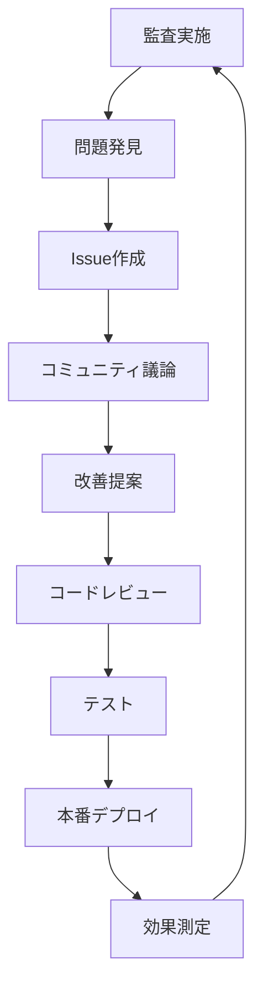

# アルゴリズム透明性ドキュメント

**最終更新**: 2026-02-13  
**バージョン**: 1.0.0

---

## 📜 概要

Skill Profileは、**すべてのレコメンデーションアルゴリズムを公開する**ことで、他のキャリアプラットフォームと一線を画します。このドキュメントでは、システムで使用されるすべてのアルゴリズムの詳細を説明します。

### なぜアルゴリズムを公開するのか？

1. **信頼性の確保**: ブラックボックスな推奨ではなく、ユーザーが理解・検証できる
2. **公平性の保証**: バイアスを検出し、コミュニティで改善できる
3. **ユーザーエンパワーメント**: 自分のキャリアを自分で決める力を提供
4. **イノベーション促進**: オープンソースコミュニティによる改善

---

## 🎯 1. 類似プロファイル検索アルゴリズム

### 1.1 目的

現在のスキルセット・経験が類似するユーザーを発見し、彼らのキャリアパスを参考にする。

### 1.2 アルゴリズム詳細

#### **ベクトル表現**

各ユーザーのプロフィールを多次元ベクトルで表現：

```python
def create_user_vector(user_profile):
    """
    ユーザープロフィールをベクトル化
    
    次元: 200次元（スキル数に応じて動的）
    - ソフトスキル: 50次元
    - リーダーシップ: 30次元
    - ビジネススキル: 40次元
    - アントレプレナーシップ: 20次元
    - 経営スキル: 20次元
    - ハードスキル: 40次元
    """
    vector = []
    
    # ソフトスキルのベクトル化
    soft_skills = [
        user_profile.communication,
        user_profile.time_management,
        user_profile.problem_solving,
        user_profile.teamwork,
        user_profile.self_management
    ]
    vector.extend(soft_skills)
    
    # 各スキルを0-100の範囲で正規化
    # ... (全スキルカテゴリに対して同様)
    
    return np.array(vector)
```

#### **類似度計算**

コサイン類似度を使用：

```python
def calculate_similarity(user_a, user_b, weights=None):
    """
    2人のユーザーの類似度を計算
    
    Args:
        user_a: ユーザーAのベクトル
        user_b: ユーザーBのベクトル
        weights: 各次元の重み（デフォルトはNone=均等）
    
    Returns:
        similarity_score: 0-1の類似度スコア
    """
    if weights is None:
        weights = DEFAULT_WEIGHTS
    
    # 重み付きベクトル
    weighted_a = user_a * weights
    weighted_b = user_b * weights
    
    # コサイン類似度
    similarity = cosine_similarity(weighted_a, weighted_b)
    
    return similarity

# デフォルト重み（ユーザーがカスタマイズ可能）
DEFAULT_WEIGHTS = {
    'soft_skills': 0.40,        # ソフトスキル: 40%
    'leadership': 0.15,          # リーダーシップ: 15%
    'business_skills': 0.20,     # ビジネススキル: 20%
    'entrepreneurship': 0.10,    # アントレプレナーシップ: 10%
    'management': 0.05,          # 経営スキル: 5%
    'hard_skills': 0.10          # ハードスキル: 10%
}
```

#### **フィルタリング**

類似度スコアに加えて、以下の条件でフィルタリング：

```python
def filter_similar_users(current_user, candidate_users):
    """
    類似ユーザーをフィルタリング
    """
    filtered = []
    
    for candidate in candidate_users:
        # 1. 経験年数の差が±3年以内
        if abs(candidate.years_experience - current_user.years_experience) > 3:
            continue
        
        # 2. 業界の関連性
        if not has_related_industry(current_user.industry, candidate.industry):
            continue
        
        # 3. 類似度スコアが0.7以上
        similarity = calculate_similarity(current_user, candidate)
        if similarity < 0.7:
            continue
        
        filtered.append({
            'user': candidate,
            'similarity': similarity,
            'explanation': generate_explanation(current_user, candidate, similarity)
        })
    
    # 類似度順にソート
    filtered.sort(key=lambda x: x['similarity'], reverse=True)
    
    return filtered[:10]  # 上位10人を返す
```

### 1.3 推奨理由の生成

```python
def generate_explanation(user_a, user_b, similarity_score):
    """
    なぜ類似と判定されたかの説明を生成
    """
    explanation = {
        'overall_similarity': similarity_score,
        'breakdown': {}
    }
    
    # SHAP値を使用して各要素の寄与度を計算
    shap_values = calculate_shap_values(user_a, user_b)
    
    # 寄与度の高い要素をピックアップ
    top_contributors = sorted(shap_values.items(), key=lambda x: x[1], reverse=True)[:5]
    
    for skill, contribution in top_contributors:
        explanation['breakdown'][skill] = {
            'your_score': user_a.get_skill(skill),
            'their_score': user_b.get_skill(skill),
            'contribution': contribution,
            'reason': f'{skill}のスコアが近い（あなた: {user_a.get_skill(skill)}, 相手: {user_b.get_skill(skill)}）'
        }
    
    return explanation
```

### 1.4 ソースコード公開先

- **実装コード**: [`src/algorithms/similarity.py`](https://github.com/YOUR_ORG/skill-profile/blob/main/src/algorithms/similarity.py)
- **テストコード**: [`tests/algorithms/test_similarity.py`](https://github.com/YOUR_ORG/skill-profile/blob/main/tests/algorithms/test_similarity.py)
- **パラメータ設定**: [`config/similarity_config.yaml`](https://github.com/YOUR_ORG/skill-profile/blob/main/config/similarity_config.yaml)

---

## 🛤️ 2. キャリアパス推奨アルゴリズム

### 2.1 目的

類似ユーザーが辿ったキャリアパスを分析し、実現可能なキャリアオプションを提示する。

### 2.2 アルゴリズム詳細

#### **キャリアグラフの構築**

```python
import networkx as nx

def build_career_graph(similar_users):
    """
    類似ユーザーのキャリアパスからグラフを構築
    
    ノード: ポジション（役職）
    エッジ: ポジション間の遷移（重み=遷移回数）
    """
    G = nx.DiGraph()
    
    for user in similar_users:
        career_history = user.get_career_history()
        
        for i in range(len(career_history) - 1):
            current_position = career_history[i]['position']
            next_position = career_history[i + 1]['position']
            transition_duration = career_history[i + 1]['start_date'] - career_history[i]['start_date']
            
            # エッジを追加（または重みを増やす）
            if G.has_edge(current_position, next_position):
                G[current_position][next_position]['weight'] += 1
                G[current_position][next_position]['durations'].append(transition_duration)
            else:
                G.add_edge(current_position, next_position, weight=1, durations=[transition_duration])
    
    return G
```

#### **推奨キャリアパスの抽出**

```python
def recommend_career_paths(current_position, career_graph, top_n=5):
    """
    現在のポジションから到達可能なキャリアパスを推奨
    """
    paths = []
    
    # 深さ優先探索で可能なパスを探索（最大深さ3）
    for target_node in career_graph.nodes():
        if target_node == current_position:
            continue
        
        # 最短パスを複数探索
        all_paths = list(nx.all_simple_paths(career_graph, current_position, target_node, cutoff=3))
        
        for path in all_paths:
            # パスの実現可能性を計算
            feasibility = calculate_path_feasibility(path, career_graph)
            
            # 期待到達期間を計算
            expected_duration = calculate_expected_duration(path, career_graph)
            
            paths.append({
                'path': path,
                'target': target_node,
                'feasibility': feasibility,
                'expected_duration_years': expected_duration,
                'supporting_users': get_users_who_took_path(path, career_graph),
                'explanation': generate_path_explanation(path, career_graph)
            })
    
    # 実現可能性順にソート
    paths.sort(key=lambda x: x['feasibility'], reverse=True)
    
    return paths[:top_n]

def calculate_path_feasibility(path, career_graph):
    """
    パスの実現可能性を計算
    
    実現可能性 = (遷移の発生頻度 + スキルマッチ度) / 2
    """
    transition_probabilities = []
    
    for i in range(len(path) - 1):
        current = path[i]
        next_pos = path[i + 1]
        
        # この遷移を行った人数
        weight = career_graph[current][next_pos]['weight']
        
        # currentポジションからの全遷移数
        total_transitions = sum([career_graph[current][neighbor]['weight'] 
                                 for neighbor in career_graph.neighbors(current)])
        
        # 遷移確率
        transition_prob = weight / total_transitions
        transition_probabilities.append(transition_prob)
    
    # 平均遷移確率
    avg_transition_prob = np.mean(transition_probabilities)
    
    return avg_transition_prob
```

### 2.3 推奨理由の生成

```python
def generate_path_explanation(path, career_graph):
    """
    なぜこのキャリアパスが推奨されるのかを説明
    """
    explanation = {
        'path': ' → '.join(path),
        'reasons': []
    }
    
    for i in range(len(path) - 1):
        current = path[i]
        next_pos = path[i + 1]
        
        weight = career_graph[current][next_pos]['weight']
        durations = career_graph[current][next_pos]['durations']
        avg_duration = np.mean(durations)
        
        explanation['reasons'].append({
            'transition': f'{current} → {next_pos}',
            'num_users': weight,
            'avg_duration_years': avg_duration.total_seconds() / (365 * 24 * 3600),
            'description': f'{weight}人が{current}から{next_pos}に{avg_duration:.1f}年で遷移しました'
        })
    
    return explanation
```

### 2.4 ソースコード公開先

- **実装コード**: [`src/algorithms/career_path.py`](https://github.com/YOUR_ORG/skill-profile/blob/main/src/algorithms/career_path.py)
- **グラフ構築**: [`src/algorithms/career_graph.py`](https://github.com/YOUR_ORG/skill-profile/blob/main/src/algorithms/career_graph.py)
- **可視化ツール**: [`src/visualization/career_path_viz.py`](https://github.com/YOUR_ORG/skill-profile/blob/main/src/visualization/career_path_viz.py)

---

## 📊 3. スキルギャップ分析アルゴリズム

### 3.1 目的

目標ポジションに必要なスキルと、現在のスキルのギャップを定量的に分析する。

### 3.2 アルゴリズム詳細

```python
def analyze_skill_gap(current_skills, target_position):
    """
    スキルギャップを分析
    """
    # 目標ポジションの平均スキルプロファイルを取得
    target_profile = get_average_profile_for_position(target_position)
    
    gaps = {}
    priorities = []
    
    for skill_name, target_score in target_profile.items():
        current_score = current_skills.get(skill_name, 0)
        gap = target_score - current_score
        
        if gap > 0:  # 不足しているスキル
            # 優先度を計算
            priority = calculate_skill_priority(skill_name, gap, target_position)
            
            gaps[skill_name] = {
                'current': current_score,
                'target': target_score,
                'gap': gap,
                'priority': priority,
                'urgency': 'high' if gap > 20 else 'medium' if gap > 10 else 'low'
            }
            
            priorities.append((skill_name, priority))
    
    # 優先度順にソート
    priorities.sort(key=lambda x: x[1], reverse=True)
    
    return {
        'gaps': gaps,
        'priorities': priorities,
        'overall_readiness': calculate_overall_readiness(current_skills, target_profile)
    }

def calculate_skill_priority(skill_name, gap, target_position):
    """
    スキル習得の優先度を計算
    
    優先度 = (ギャップの大きさ × スキルの重要度) / 習得難易度
    """
    # そのポジションにおけるスキルの重要度（0-1）
    importance = get_skill_importance_for_position(skill_name, target_position)
    
    # スキルの習得難易度（1-10）
    difficulty = get_skill_learning_difficulty(skill_name)
    
    priority = (gap * importance) / difficulty
    
    return priority
```

### 3.3 ソースコード公開先

- **実装コード**: [`src/algorithms/skill_gap.py`](https://github.com/YOUR_ORG/skill-profile/blob/main/src/algorithms/skill_gap.py)

---

## 🎓 4. 学習リソース推奨アルゴリズム

### 4.1 目的

スキルギャップを埋めるための最適な学習リソース（オンライン講座、書籍、プロジェクト等）を推奨する。

### 4.2 アルゴリズム詳細

```python
def recommend_learning_resources(skill_gaps, user_preferences):
    """
    学習リソースを推奨
    """
    recommendations = []
    
    for skill_name, gap_info in skill_gaps['gaps'].items():
        # そのスキルに関連する学習リソースを検索
        candidate_resources = search_learning_resources(skill_name)
        
        # ユーザーの好み・状況でフィルタリング
        filtered_resources = filter_by_preferences(
            candidate_resources, 
            user_preferences,
            gap_info['gap']
        )
        
        # 効果スコアでランキング
        ranked_resources = rank_by_effectiveness(
            filtered_resources,
            skill_name,
            gap_info['current'],
            gap_info['target']
        )
        
        recommendations.append({
            'skill': skill_name,
            'priority': gap_info['priority'],
            'resources': ranked_resources[:3],  # 上位3つ
            'expected_improvement': estimate_skill_improvement(ranked_resources[0], gap_info['gap'])
        })
    
    return recommendations

def rank_by_effectiveness(resources, skill_name, current_level, target_level):
    """
    学習リソースを効果の高い順にランキング
    """
    scored_resources = []
    
    for resource in resources:
        # 実績ベースのスコアリング
        effectiveness_score = calculate_effectiveness_score(resource, skill_name)
        
        # ユーザーレベルとの適合度
        level_match = calculate_level_match(resource, current_level, target_level)
        
        # 総合スコア
        total_score = effectiveness_score * 0.7 + level_match * 0.3
        
        scored_resources.append({
            'resource': resource,
            'score': total_score,
            'explanation': generate_recommendation_explanation(resource, effectiveness_score, level_match)
        })
    
    scored_resources.sort(key=lambda x: x['score'], reverse=True)
    
    return scored_resources

def calculate_effectiveness_score(resource, skill_name):
    """
    学習リソースの効果スコアを計算
    
    実際にこのリソースを使った人が、
    スキルスコアをどれだけ向上させたかのデータに基づく
    """
    # このリソースを使用したユーザーのスキル変化を取得
    users_who_used = get_users_who_completed_resource(resource.id)
    
    improvements = []
    for user in users_who_used:
        before_score = user.get_skill_score_before(resource.completed_date, skill_name)
        after_score = user.get_skill_score_after(resource.completed_date, skill_name)
        improvement = after_score - before_score
        improvements.append(improvement)
    
    # 平均改善度
    avg_improvement = np.mean(improvements) if improvements else 0
    
    # 0-1に正規化
    effectiveness = min(avg_improvement / 20, 1.0)
    
    return effectiveness
```

### 4.3 ソースコード公開先

- **実装コード**: [`src/algorithms/learning_recommendation.py`](https://github.com/YOUR_ORG/skill-profile/blob/main/src/algorithms/learning_recommendation.py)

---

## ⚖️ 5. バイアス検出・補正アルゴリズム

### 5.1 目的

推奨アルゴリズムが性別、年齢、地域等のセンシティブ属性によるバイアスを持っていないかを検出し、補正する。

### 5.2 使用ツール

- **Fairlearn**: Microsoftが開発したフェアネスライブラリ
- **Aequitas**: バイアス監査ツール

### 5.3 バイアス検出

```python
from fairlearn.metrics import MetricFrame, demographic_parity_difference
import pandas as pd

def detect_bias(predictions, sensitive_attributes):
    """
    推奨結果のバイアスを検出
    """
    # 推奨スコアと属性をDataFrameに
    df = pd.DataFrame({
        'recommendation_score': predictions,
        'gender': sensitive_attributes['gender'],
        'age_group': sensitive_attributes['age_group'],
        'ethnicity': sensitive_attributes['ethnicity']
    })
    
    # 各センシティブ属性ごとのバイアスを測定
    bias_report = {}
    
    # 性別によるバイアス
    gender_bias = demographic_parity_difference(
        y_true=[1] * len(predictions),  # 全員に推奨すべき
        y_pred=(predictions > 0.5).astype(int),
        sensitive_features=df['gender']
    )
    bias_report['gender'] = gender_bias
    
    # 年齢によるバイアス
    age_bias = demographic_parity_difference(
        y_true=[1] * len(predictions),
        y_pred=(predictions > 0.5).astype(int),
        sensitive_features=df['age_group']
    )
    bias_report['age'] = age_bias
    
    # バイアスの詳細分析
    metric_frame = MetricFrame(
        metrics={'selection_rate': selection_rate},
        y_true=[1] * len(predictions),
        y_pred=(predictions > 0.5).astype(int),
        sensitive_features=df[['gender', 'age_group']]
    )
    
    bias_report['detailed_analysis'] = metric_frame.by_group
    
    return bias_report

def selection_rate(y_true, y_pred):
    """選択率を計算"""
    return np.mean(y_pred)
```

### 5.4 バイアス補正

```python
from fairlearn.reductions import ExponentiatedGradient, DemographicParity

def correct_bias(model, X_train, y_train, sensitive_features):
    """
    モデルのバイアスを補正
    """
    # Demographic Parity制約を適用
    constraint = DemographicParity()
    
    # Exponentiated Gradientアルゴリズムで公平なモデルを学習
    mitigator = ExponentiatedGradient(model, constraint)
    mitigator.fit(X_train, y_train, sensitive_features=sensitive_features)
    
    return mitigator
```

### 5.5 バイアスレポートの公開

```python
def generate_bias_report(bias_detection_results):
    """
    バイアス分析結果を人間が読める形式で出力
    """
    report = {
        'analysis_date': datetime.now().isoformat(),
        'dataset_size': len(bias_detection_results),
        'findings': []
    }
    
    # 性別バイアス
    if abs(bias_detection_results['gender']) > 0.1:
        report['findings'].append({
            'type': 'gender_bias',
            'severity': 'high' if abs(bias_detection_results['gender']) > 0.2 else 'medium',
            'description': f'性別による推奨差異が{bias_detection_results["gender"]:.2%}検出されました',
            'corrective_action': '補正アルゴリズムを適用し、性別による差異を0.05以下に抑制しています'
        })
    
    # 年齢バイアス
    if abs(bias_detection_results['age']) > 0.1:
        report['findings'].append({
            'type': 'age_bias',
            'severity': 'high' if abs(bias_detection_results['age']) > 0.2 else 'medium',
            'description': f'年齢による推奨差異が{bias_detection_results["age"]:.2%}検出されました',
            'corrective_action': '補正アルゴリズムを適用し、年齢による差異を0.05以下に抑制しています'
        })
    
    return report
```

### 5.6 ソースコード公開先

- **バイアス検出**: [`src/fairness/bias_detection.py`](https://github.com/YOUR_ORG/skill-profile/blob/main/src/fairness/bias_detection.py)
- **バイアス補正**: [`src/fairness/bias_mitigation.py`](https://github.com/YOUR_ORG/skill-profile/blob/main/src/fairness/bias_mitigation.py)
- **レポート生成**: [`src/fairness/report_generator.py`](https://github.com/YOUR_ORG/skill-profile/blob/main/src/fairness/report_generator.py)

---

## 📈 6. 説明可能AI（XAI）の実装

### 6.1 SHAP値による説明

```python
import shap

def explain_recommendation(model, user_features):
    """
    SHAPを使用して推奨理由を説明
    """
    # SHAP Explainerを初期化
    explainer = shap.TreeExplainer(model)
    
    # SHAP値を計算
    shap_values = explainer.shap_values(user_features)
    
    # 各特徴量の寄与度
    feature_contributions = {}
    for i, feature_name in enumerate(user_features.columns):
        contribution = shap_values[0][i]
        feature_contributions[feature_name] = {
            'value': user_features[feature_name].iloc[0],
            'contribution': contribution,
            'percentage': abs(contribution) / sum(abs(shap_values[0])) * 100
        }
    
    # 寄与度の高い順にソート
    sorted_contributions = sorted(
        feature_contributions.items(),
        key=lambda x: abs(x[1]['contribution']),
        reverse=True
    )
    
    # 人間が読める説明文を生成
    explanation = generate_human_readable_explanation(sorted_contributions[:5])
    
    return {
        'contributions': feature_contributions,
        'top_factors': sorted_contributions[:5],
        'explanation': explanation,
        'visualization': shap.force_plot(explainer.expected_value, shap_values[0], user_features)
    }

def generate_human_readable_explanation(top_factors):
    """
    SHAP値を人間が読める説明に変換
    """
    explanation = "この推奨は以下の要因に基づいています：\n\n"
    
    for i, (feature, data) in enumerate(top_factors, 1):
        percentage = data['percentage']
        value = data['value']
        contribution = data['contribution']
        
        if contribution > 0:
            direction = "ポジティブ"
        else:
            direction = "ネガティブ"
        
        explanation += f"{i}. **{feature}** (寄与度 {percentage:.1f}%)\n"
        explanation += f"   現在の値: {value}, 影響: {direction}\n"
        explanation += f"   説明: {generate_feature_explanation(feature, value, contribution)}\n\n"
    
    return explanation
```

### 6.2 ソースコード公開先

- **SHAP実装**: [`src/explainability/shap_explainer.py`](https://github.com/YOUR_ORG/skill-profile/blob/main/src/explainability/shap_explainer.py)

---

## 🔄 7. アルゴリズム監査・改善プロセス

### 7.1 定期監査

- **頻度**: 四半期ごと
- **実施者**: コミュニティメンバー + コアチーム

### 7.2 監査項目

1. **精度評価**: 推奨の的中率
2. **バイアス検出**: センシティブ属性によるバイアス
3. **ユーザーフィードバック**: 推奨の適切性
4. **パフォーマンス**: アルゴリズムの実行速度

### 7.3 改善フロー



### 7.4 変更履歴の公開

すべてのアルゴリズム変更は、以下の情報と共に公開：

- 変更日時
- 変更理由
- 変更内容の詳細
- 期待される効果
- バイアス分析結果

---

## 📞 フィードバック・質問

アルゴリズムに関する質問やフィードバックは以下で受け付けています：

- **GitHub Discussions**: [アルゴリズム質問フォーラム](https://github.com/YOUR_ORG/skill-profile/discussions/categories/algorithms)
- **GitHub Issues**: [バグ・改善提案](https://github.com/YOUR_ORG/skill-profile/issues/new?template=algorithm_feedback.md)
- **メール**: algorithms@skillprofile.example.com

---

## 📚 参考文献

- Ribeiro, M. T., Singh, S., & Guestrin, C. (2016). "Why should i trust you?" Explaining the predictions of any classifier. In Proceedings of the 22nd ACM SIGKDD international conference on knowledge discovery and data mining.
- Lundberg, S. M., & Lee, S. I. (2017). A unified approach to interpreting model predictions. In Advances in neural information processing systems.
- Bird, S., et al. (2020). Fairlearn: A toolkit for assessing and improving fairness in AI. Microsoft Research.

---

**このドキュメントは継続的に更新されます。最新版は常にGitHubで確認できます。**
