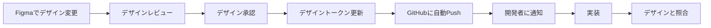

# Figma と GitHub の連携ガイド

## 概要

FigmaとGitHubを連携することで、デザインと開発をシームレスに統合できます。

## 連携方法

### 1. FigmaファイルのリンクをGitHubに追加（基本）

#### ステップ1: Figmaファイルの共有設定

1. Figmaでファイルを開く
2. 右上の「Share」ボタンをクリック
3. 「Copy link」でリンクをコピー
4. 公開設定を「Anyone with the link」に設定（チーム外の開発者も閲覧可能にする場合）

#### ステップ2: GitHubのREADMEに追加

```markdown
## デザイン

### Figmaファイル
- [デザインシステム](https://www.figma.com/file/xxxxx/Design-System)
- [ワイヤーフレーム](https://www.figma.com/file/xxxxx/Wireframes)
- [UIデザイン](https://www.figma.com/file/xxxxx/UI-Design)
- [プロトタイプ](https://www.figma.com/file/xxxxx/Prototype)
```

---

### 2. GitHub Issuesとの連携

FigmaのコメントをGitHub Issuesと連携できます。

#### Figma for GitHub プラグイン

1. **プラグインのインストール**
   - Figmaで「Plugins」→「Browse plugins」
   - 「GitHub」で検索
   - 「Figma for GitHub」をインストール

2. **GitHubアカウントと連携**
   - プラグインを起動
   - GitHubアカウントで認証
   - リポジトリを選択

3. **使い方**
   - Figmaのコメントに `#123` のようにIssue番号を記載
   - GitHub IssueにFigmaのリンクを追加
   - 双方向で参照可能

---

### 3. デザイントークンの自動同期

デザイントークンをFigmaからGitHubに自動エクスポートします。

#### Style Dictionary + Figma Tokens プラグイン

**必要なもの:**
- Figma Tokens プラグイン
- GitHub Personal Access Token
- GitHub Repository

**セットアップ手順:**

1. **Figma Tokensプラグインをインストール**
   ```
   Figma → Plugins → Browse plugins → "Figma Tokens"
   ```

2. **GitHub Personal Access Tokenを作成**
   - GitHubで Settings → Developer settings → Personal access tokens → Tokens (classic)
   - 「Generate new token」をクリック
   - スコープ: `repo` を選択
   - トークンをコピー

3. **Figma TokensでGitHubと連携**
   - プラグインを起動
   - Settings → Sync → GitHub
   - 以下を入力:
     - **Name**: `skill-profile`
     - **Personal Access Token**: 先ほど作成したトークン
     - **Repository**: `<username>/skill-profile`
     - **Branch**: `main`
     - **File Path**: `design-tokens.json`

4. **トークンを設定**
   - Figmaのカラー、タイポグラフィ、スペーシングをトークンとして定義
   - 「Push to GitHub」をクリック
   - `design-tokens.json` が自動的にGitHubにコミットされる

---

### 4. Figma → Code の自動生成

#### Figma to Code プラグイン

1. **プラグインをインストール**
   - 「Figma to Code」プラグインをインストール

2. **コンポーネントからコード生成**
   - コンポーネントを選択
   - プラグインを起動
   - React/Vue/Tailwind等の形式を選択
   - コードをコピーしてプロジェクトに追加

---

### 5. GitHub Actions で Figma アセットを自動エクスポート

デザイン変更時に自動でアセットをエクスポートします。

#### セットアップ

1. **Figma API Tokenを取得**
   - Figma → Settings → Account → Personal access tokens
   - 「Create a new personal access token」
   - トークンをコピー

2. **GitHub SecretsにFigma Tokenを追加**
   - GitHub Repository → Settings → Secrets and variables → Actions
   - 「New repository secret」をクリック
   - Name: `FIGMA_TOKEN`
   - Value: Figmaのトークン

3. **GitHub Actionsワークフローを作成**

```yaml
# .github/workflows/figma-export.yml
name: Export Figma Assets

on:
  workflow_dispatch: # 手動トリガー
  schedule:
    - cron: '0 0 * * 1' # 毎週月曜日に実行

jobs:
  export:
    runs-on: ubuntu-latest
    steps:
      - uses: actions/checkout@v3
      
      - name: Export Figma Assets
        uses: primer/figma-action@v1
        with:
          figma-token: ${{ secrets.FIGMA_TOKEN }}
          file-key: ${{ secrets.FIGMA_FILE_KEY }}
          output-dir: ./public/assets
          
      - name: Commit changes
        run: |
          git config --local user.email "action@github.com"
          git config --local user.name "GitHub Action"
          git add public/assets/
          git diff --quiet && git diff --staged --quiet || git commit -m "Update Figma assets"
          git push
```

---

### 6. Figma ウィジェットで GitHub情報を表示

Figmaファイル内でGitHubの情報を表示します。

#### GitHub Widget

1. **ウィジェットをインストール**
   - Figma → Widgets → Browse widgets
   - 「GitHub」で検索

2. **ウィジェットを配置**
   - Figmaファイルにウィジェットを追加
   - GitHubリポジトリを連携
   - Issues、PRの状態をFigma上で確認可能

---

## ワークフロー例

### デザイン変更 → 開発への反映



### 具体的な手順

1. **デザイナー**: Figmaでデザインを変更
2. **デザイナー**: Figmaコメントでレビュー依頼（GitHub Issue番号を記載）
3. **レビュワー**: Figmaでコメント、または GitHub Issueで議論
4. **デザイナー**: 承認後、Figma Tokensで「Push to GitHub」
5. **自動**: `design-tokens.json` がGitHubにコミット
6. **開発者**: Pull Request を確認、最新トークンを使用して実装
7. **開発者**: Figma Dev Modeで最終確認

---

## ベストプラクティス

### 1. 命名規則の統一
- FigmaのコンポーネントとGitHubのコンポーネントファイル名を一致させる
- 例: Figma `Button/Primary` → `Button.tsx` の `PrimaryButton`

### 2. ブランチ戦略
- デザインの大きな変更は Figma Branches を使用
- 実装ブランチと対応させる
  - Figma: `feature/new-dashboard`
  - GitHub: `feature/new-dashboard`

### 3. ドキュメント化
- Figmaファイルの各ページに説明を追加
- GitHubのREADMEにFigmaリンクを記載
- 変更履歴をGitHub Issuesで管理

### 4. コミュニケーション
- Figmaコメントに `@mention` を使用
- GitHub IssueにFigmaリンクを追加
- 重要な変更はSlack等で通知

---

## トラブルシューティング

### 問題: Figma TokensがGitHubにPushできない

**解決策:**
- Personal Access Tokenの権限を確認（`repo`スコープが必要）
- リポジトリ名とブランチ名が正しいか確認
- ファイルパスが正しいか確認

### 問題: GitHub ActionsでFigmaアセットがエクスポートできない

**解決策:**
- `FIGMA_TOKEN` が正しくSecretsに設定されているか確認
- Figma File Keyが正しいか確認（URLの `/file/` の後の文字列）
- Figma APIの権限を確認

### 問題: デザインと実装が乖離している

**解決策:**
- 定期的にデザイン←→実装の照合ミーティングを実施
- Figma Dev ModeのStatusを活用（Ready for dev, In progress, Completed）
- GitHub Issueで差異を管理

---

## 参考リソース

### 公式ドキュメント
- [Figma API Documentation](https://www.figma.com/developers/api)
- [Figma Plugins](https://www.figma.com/community/plugins)
- [GitHub Actions](https://docs.github.com/en/actions)

### プラグイン・ツール
- [Figma Tokens](https://www.figma.com/community/plugin/843461159747178978/Figma-Tokens)
- [Figma to Code](https://www.figma.com/community/plugin/842128343887142055/Figma-to-Code)
- [Style Dictionary](https://amzn.github.io/style-dictionary/)

### 学習リソース
- [Figma for Developers](https://www.figma.com/developers)
- [Design System Ops](https://www.designsystems.com/)
