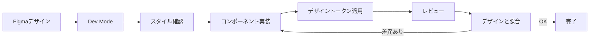

# Figma 連携ワークフロー

## 目次
1. [初期セットアップ](#初期セットアップ)
2. [デザインフェーズ](#デザインフェーズ)
3. [開発フェーズ](#開発フェーズ)
4. [メンテナンス](#メンテナンス)

---

## 初期セットアップ

### 1. Figmaアカウントとチーム設定

#### アカウント作成
1. [Figma](https://www.figma.com/)にアクセス
2. アカウントを作成（無料プランで開始可能）
3. チームを作成または既存チームに参加

#### プロジェクト構造
```
Skill Profile Team/
├── 📁 Design System
├── 📁 Wireframes
├── 📁 UI Design
│   ├── 📄 Dashboard
│   ├── 📄 Profile
│   ├── 📄 Skills Management
│   ├── 📄 Analytics
│   └── 📄 Settings
└── 📁 Prototypes
```

### 2. Figmaファイルの作成

#### デザインシステムファイル
新しいFigmaファイルを作成：
- **ファイル名**: `Skill Profile - Design System`
- **目的**: コンポーネント、スタイル、デザイントークンの管理

#### 必須ページ構成
1. **Cover** - プロジェクト概要
2. **Colors** - カラーパレット
3. **Typography** - フォントスタイル
4. **Components** - 再利用可能なコンポーネント
5. **Icons** - アイコンライブラリ
6. **Spacing** - スペーシングシステム
7. **Shadows & Effects** - エフェクトライブラリ

### 3. デザイントークンの設定

#### カラースタイルの作成
1. Figmaで右クリック → `Styles` → `Color Style`
2. 以下のカラーを設定：
   ```
   Primary/50, Primary/100, ..., Primary/900
   Secondary/50, Secondary/100, ..., Secondary/900
   Neutral/0, Neutral/50, ..., Neutral/1000
   Success, Warning, Error, Info
   ```

#### テキストスタイルの作成
1. Figmaで右クリック → `Styles` → `Text Style`
2. 以下のスタイルを設定：
   ```
   Heading/H1 (48px, Bold)
   Heading/H2 (36px, Bold)
   Heading/H3 (30px, Semibold)
   Heading/H4 (24px, Semibold)
   Heading/H5 (20px, Medium)
   Heading/H6 (18px, Medium)
   Body/Large (18px, Regular)
   Body/Base (16px, Regular)
   Body/Small (14px, Regular)
   Caption (12px, Regular)
   ```

#### エフェクトスタイルの作成
1. Figmaで右クリック → `Styles` → `Effect Style`
2. シャドウを設定：
   ```
   Shadow/SM
   Shadow/MD
   Shadow/LG
   Shadow/XL
   ```

---

## デザインフェーズ

### フェーズ1: ワイヤーフレーム

#### 主要画面のワイヤーフレーム作成
1. **ダッシュボード**
   - ユーザー概要
   - スキルサマリー
   - 最近の活動
   - 目標進捗

2. **プロフィール画面**
   - 基本情報表示
   - スキル一覧
   - プロジェクト実績
   - 証明書・資格

3. **スキル管理画面**
   - スキル追加/編集
   - レベル設定
   - 証跡アップロード

4. **アナリティクス画面**
   - スキルマップ
   - 成長グラフ
   - 統計情報

5. **設定画面**
   - アカウント設定
   - プライバシー設定
   - 公開設定

#### ユーザーフロー図の作成
- FigJamまたはFigmaのFigjamファイルを使用
- 主要なユーザージャーニーをマッピング
- 画面遷移を視覚化

### フェーズ2: 高詳細度デザイン

#### コンポーネントの作成

##### Atoms（原子）
```
Button/
├── Primary (Default, Hover, Active, Disabled)
├── Secondary (Default, Hover, Active, Disabled)
├── Outline (Default, Hover, Active, Disabled)
└── Text (Default, Hover, Active, Disabled)

Input/
├── Text (Default, Focus, Error, Disabled)
├── Password (Default, Focus, Error, Disabled)
├── TextArea (Default, Focus, Error, Disabled)
└── Select (Default, Focus, Error, Disabled)

Badge/
├── Default
├── Success
├── Warning
└── Error

Avatar/
├── Small (32x32)
├── Medium (48x48)
├── Large (64x64)
└── XLarge (96x96)
```

##### Molecules（分子）
```
FormField/
└── Label + Input + Helper Text + Error Message

Card/
├── Basic Card
├── Skill Card
├── Project Card
└── Achievement Card

SearchBar/
└── Search Icon + Input + Filter Button

Navigation Item/
├── Default
├── Active
└── Hover
```

##### Organisms（有機体）
```
Header/
├── Logo
├── Navigation
├── Search
└── User Menu

Sidebar/
├── Navigation Items
├── User Info
└── Footer

SkillCard/
├── Skill Icon
├── Skill Name
├── Level Indicator
├── Experience Years
└── Actions

ProfileCard/
├── Avatar
├── Name & Title
├── Bio
├── Skills Summary
└── Contact Info
```

#### 各画面のデザイン作成
1. ワイヤーフレームを参照
2. デザインシステムのコンポーネントを使用
3. レスポンシブ対応（Desktop, Tablet, Mobile）
4. ダークモード対応（オプション）

### フェーズ3: プロトタイプ作成

#### インタラクティブプロトタイプ
1. Figmaのプロトタイプモードに切り替え
2. 画面間の遷移を設定
3. ホバー、クリックなどのインタラクションを追加
4. トランジションアニメーションを設定

#### プロトタイプのテスト
1. Figmaの再生ボタンでプレビュー
2. モバイルデバイスでテスト（Figma Mirrorアプリ使用）
3. ステークホルダーとレビュー

---

## 開発フェーズ

### Figma Dev Modeの使用

#### Dev Modeの有効化
1. Figmaファイルを開く
2. 右上の「Dev Mode」ボタンをクリック
3. 開発者向けビューに切り替わる

#### コードインスペクト
1. 任意の要素を選択
2. 右パネルでコードを確認
   - CSS
   - Tailwind CSS
   - iOS (SwiftUI)
   - Android (Compose)

#### デザイントークンのエクスポート

##### 方法1: 手動エクスポート
1. デザインシステムファイルを開く
2. カラー、タイポグラフィ、スペーシングを確認
3. `design-tokens.json`を更新

##### 方法2: プラグイン使用
1. Figmaプラグイン「Design Tokens」をインストール
2. プラグインを起動
3. JSON形式でエクスポート
4. プロジェクトの`design-tokens.json`に保存

### アセットのエクスポート

#### アイコンのエクスポート
1. アイコンを選択
2. 右パネルで「Export」セクションを開く
3. フォーマット: SVG
4. 設定: `<svg>` タグを含める、最適化する
5. エクスポート先: `public/assets/icons/`

#### 画像のエクスポート
1. 画像を選択
2. 複数解像度でエクスポート：
   - 1x (base)
   - 2x (Retina)
   - 3x (高解像度)
3. フォーマット: WebP推奨（PNG/JPEGも可）
4. エクスポート先: `public/assets/images/`

### コンポーネント実装

#### Figma → Code フロー



#### 実装チェックリスト

**ビジュアル**
- [ ] カラーがデザインと一致
- [ ] フォントサイズ・ウェイトが一致
- [ ] スペーシングが一致
- [ ] ボーダー・シャドウが一致

**レスポンシブ**
- [ ] モバイルで正しく表示
- [ ] タブレットで正しく表示
- [ ] デスクトップで正しく表示
- [ ] ブレークポイントが適切

**インタラクション**
- [ ] ホバー状態
- [ ] フォーカス状態
- [ ] アクティブ状態
- [ ] ローディング状態
- [ ] エラー状態

**アクセシビリティ**
- [ ] 色のコントラスト比が適切
- [ ] キーボード操作可能
- [ ] スクリーンリーダー対応
- [ ] ARIAラベル設定

---

## メンテナンス

### デザインシステムの更新

#### 新しいコンポーネントの追加
1. Figmaのデザインシステムファイルで作成
2. コンポーネントとして登録
3. ドキュメントに使用方法を記載
4. 開発チームに通知

#### 既存コンポーネントの変更
1. バージョンを保存（Figmaのバージョン履歴）
2. コンポーネントを更新
3. 影響範囲を確認
4. 開発チームに通知
5. 実装を更新

### Figma ↔ Code の同期

#### 定期的な確認
- 週次: デザインと実装の差分チェック
- 月次: デザインシステムの棚卸し
- 四半期: 大規模なリファクタリング検討

#### バージョン管理
- Figmaファイルの重要な変更時にバージョンを保存
- バージョン名に日付とメジャー変更内容を記載
  - 例: `2024-02-13 - Button component update`

### コラボレーション

#### デザインレビュー
1. Figmaのコメント機能を使用
2. 特定の要素にコメントを追加
3. `@mention`で担当者にアサイン
4. 解決したコメントをマーク

#### フィードバックループ
```
デザイン作成
    ↓
レビュー依頼（Figmaコメント）
    ↓
フィードバック反映
    ↓
承認
    ↓
開発実装
    ↓
実装レビュー
    ↓
デザインと照合
    ↓
リリース
```

---

## ツールとプラグイン

### 推奨Figmaプラグイン

1. **Figma to Code (HTML/CSS/React)**
   - コード生成プラグイン
   - React/Vue/Tailwind対応

2. **Stark (アクセシビリティ)**
   - コントラストチェック
   - 色覚異常シミュレーション

3. **Iconify**
   - 15万以上のアイコンライブラリ
   - Material Icons, Font Awesome等

4. **Unsplash**
   - 高品質な画像素材
   - 商用利用可能

5. **Lorem Ipsum**
   - ダミーテキスト生成
   - 多言語対応

6. **Autoflow**
   - フローチャート作成
   - ユーザーフロー図

### 開発ツール連携

#### Figma API
```javascript
// Figma APIを使用してデザインデータを取得
const figmaApiKey = 'YOUR_FIGMA_API_KEY';
const fileKey = 'YOUR_FILE_KEY';

fetch(`https://api.figma.com/v1/files/${fileKey}`, {
  headers: {
    'X-Figma-Token': figmaApiKey
  }
})
  .then(response => response.json())
  .then(data => console.log(data));
```

#### Figma Webhook
- デザイン変更時に自動通知
- CI/CDパイプラインと連携
- アセットの自動エクスポート

---

## トラブルシューティング

### よくある問題

#### 問題: Figmaで作成したコンポーネントが実装時に異なる
**解決策**:
- Dev Modeで正確な値を確認
- デザイントークンを使用
- 疑問点はデザイナーに確認

#### 問題: レスポンシブ対応の実装が難しい
**解決策**:
- Figmaで各ブレークポイントのデザインを作成
- Auto Layoutを活用
- Flexbox/Gridのように考える

#### 問題: アセットのエクスポートが面倒
**解決策**:
- エクスポートプリセットを設定
- 命名規則を統一
- プラグインで自動化

---

## リソース

### 公式ドキュメント
- [Figma Help Center](https://help.figma.com/)
- [Figma Dev Mode Guide](https://help.figma.com/hc/en-us/articles/15023124644247)
- [Figma API Documentation](https://www.figma.com/developers/api)

### 学習リソース
- [Figma YouTube Channel](https://www.youtube.com/c/Figmadesign)
- [Design Systems Community](https://www.designsystems.com/)
- [Figma Community](https://www.figma.com/community)

### テンプレート
- [Figma Community Templates](https://www.figma.com/community/search?resource_type=mixed&sort_by=relevancy&query=design%20system&editor_type=all)
- [Material Design Kit](https://www.figma.com/community/file/778763161265841481)
